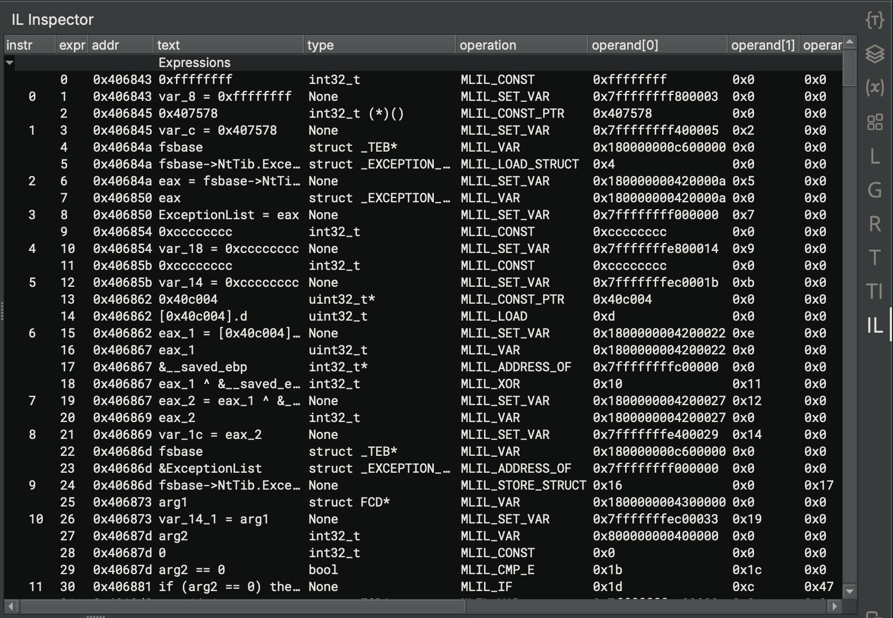

# Modifying ILs

Modifying ILs during lifting is a complex process with many factors to consider.

## Support

APIs for modifying ILs are under active development, with support depending on which level of IL and which language you use.

Key:

- ✅ Full support
- ⚠️ Partial support
- ❌ No support

| IL Level        | C++ | Python | Rust |
|-----------------|:---:|:------:|:----:|
| Lifted IL       |  ✅  |   ✅    |  ✅   |
| Low Level IL    |  ✅  |   ✅    |  ✅   |
| Medium Level IL |  ✅  |   ✅    |  ❌   |
| High Level IL   | ⚠️* |   ❌    |  ❌   |

\* Modifying High Level IL in C++, while some APIs exist, is incomplete and [certain more complicated operations are not possible yet](#notes-on-hlil).

## Choosing A Level of IL To Modify

One of the most important considerations to make when modifying ILs is, "What level of IL do I need to modify?"
Depending on what effects you want to have, different levels will work better.

- Modifying **Lifted IL** is similar to a generic Architecture Extension, letting you change instructions directly out of the lifter.
Note that Lifted IL has no SSA forms, dataflow, stack offsets, or even resolved flags.
    - **You probably do not want to modify Lifted IL with a Workflow**. Instead, consider modifying the Architecture directly ([most of which are Open Source on our GitHub](https://github.com/Vector35/binaryninja-api/tree/dev/arch)) or making your Activity modify Low Level IL.
- Modifying **Low Level IL** lets you affect operations on registers, which eventually affect values of variables (in MLIL).
Depending on where in the pipeline you insert your action, stack offsets may or may not be calculated, and most dataflow information is not available.
Notably, any `PossibleValueSet` calculations require MLIL or higher, so only `RegisterValue` dataflow results are available (and only after generating SSA form).
- Modifying **Medium Level IL** lets you modify uses of variables with the ability to solve for values in many cases, but is too late to let you change IL to create new variables properly. Changes can affect HLIL structuring.
- Modifying **High Level IL** lets you affect the final presentation of the decompiled code directly, but requires working with the expression AST and cannot affect things like value set analysis. HLIL does not have the same guarantees that variables and statements exist in the original code, and expressions can be changed completely from their original forms or be created from thin air.

There are certain ILs which you cannot modify, for a variety of reasons:

- **SSA Forms** are generated by the core from the various Non-SSA Form ILs at each stage of analysis. You should not modify them, as they are considered analysis derived from the Non-SSA Form. They will likely be regenerated from the source Non-SSA Form without consulting any changes you might make to them.
- **Disassembly** should be modified by changing the Architecture plugin if it is open source, or by using an Architecture Extension if it is not. A Workflow Activity cannot affect Disassembly.
- **Mapped MLIL** is lifted directly from LLIL SSA Form and not user-editable. Generally speaking, users and developers of Workflow Actions should not need to consult Mapped MLIL.
- **Pseudo-C** and other Language Representation forms are not a distinct level of IL, but are simply alternate renderings of HLIL.

## Considerations

Based on your IL of choice, there are a bunch of places you can insert your modification action, which affects the information available to use or modify.

- **Lifted IL** modification needs to happen before the `core.function.analyzeAndExpandFlags` stage, which translates Lifted IL into Low Level IL. After that stage, Lifted IL is never again consulted.
    - Modifying flag definitions and usages is likely impossible, as the Semantic Flags system will consult the Architecture to determine what IL to generate when a flag is used, not your Workflow Action. There is currently no way to change this behavior.
- **Low Level IL** modification is generally done right before the `core.function.generateMediumLevelIL` stage, after the final Low Level IL function is emitted. After Medium Level IL is generated, changes to the Low Level IL will have limited effects on the other ILs (because most things refer to MLIL).
    - If you want to make changes to LLIL that can affect the stack pointer resolution, you will want to insert your action before `core.function.analyzeStackAdjustment` instead.
- **Medium Level IL** modification is generally done right after `core.function.generateMediumLevelIL` since (as of writing) the MLIL translation is all done in that one monolithic step and future steps are simply processing and annotations. This may change some time in the future.
- **High Level IL** modification is generally done right after `core.function.generateHighLevelIL` since HLIL generation is also monolithic. This also may change eventually.

### Notes on HLIL

Cross-IL mappings are currently not implemented when modifying HLIL (see [Support](#support)), and modified functions will lose the ability to follow an expression to its MLIL equivalent (and likewise MLIL -> HLIL will be unavailable).
Support for this is planned soon, but not implemented as of Binary Ninja 5.1.

## Terminology

- An **IL Function** is a collection of **IL Instructions**, grouped into **IL Basic Blocks**
- An **IL Basic Block** is a contiguous sequence of **IL Instructions** between a start and end **Instruction Index**, which only has incoming branches at the start and outgoing branches at the end.
- An **IL Expression** is a single-operation expression, which may have child expressions or be the child of another expression.
    - The `*LevelILInstruction` class represents a single **IL Expression**. The class name may be confusing since **IL Instructions** are a different concept.
- An **Expression Index** points to an **IL Expression** and may be used as an operand of another **IL Expression**.
- An **IL Instruction** is an **IL Expression** that has been added as a top-level instruction to the function with a call to `*LevelILFunction.append()` (C++: `*LevelILFunction::AddInstruction`)
- An **Instruction Index** is assigned to an **IL Expression** that is added as an **IL Instruction**. Child expressions of an **IL Instruction** do not inherently have an **Instruction Index**, though the API tries to provide this for you.
- A **Mutate Transformation** is a simple modification of **IL Instructions** in an **IL Function** as per [Replacing Trivial Instructions (Mutate Transformation)](#replacing-trivial-instructions-mutate-transformation) below.
- A **Copy Transformation** is a more in-depth modification of an **IL Function** which involves copying its **IL Instructions** into a newly constructed **IL Function** with modifications made along the way, as per [Adding Instructions and Replacing Multiple Instructions (Copy Transformation)](#adding-instructions-and-replacing-multiple-instructions-copy-transformation) below.

## Writing a Transformation

Once you figure out which level of IL you want to modify, and where in the Workflow pipeline you want to do modifications, it is time to write some code!

### Registering Your Plugin

In order for your modifications to run, you need to register a Workflow Activity.
There are a couple of steps involved in this process:

First, you need to make a clone of the default workflow, making it mutable and allowing you to insert your Activity.
You can either name the clone the same thing as the metaAnalysis workflow to make your Activity available by default,
or clone to a different name, which will require users to select that workflow in Open with Options.

Also note that, as of writing, Objective-C support registers its own workflow as `core.function.objectiveC`.
If you want your Workflow Activity to apply to Objective-C files, you will need to do this whole process twice, once for `core.function.metaAnalysis` and once for `core.function.objectiveC`.
The same applies if any of your other plugins register a custom workflow that is not `core.function.metaAnalysis`.

=== "Python"
    ```py
    # This Workflow will replace metaAnalysis and be used by default
    wf = Workflow("core.function.metaAnalysis").clone("core.function.metaAnalysis")

    # Users will need to pick this Workflow in Open with Options
    wf = Workflow("core.function.metaAnalysis").clone("MyCustomWorkflow")

    # As of 5.1: To modify functions in binaries using the Objective-C workflow,
    # you need to do the entire rest of this section twice:
    # once as above, and once for the Objective-C workflow as shown here.
    wf = Workflow("core.function.objectiveC").clone("core.function.objectiveC")
    ```

=== "C++"
    ```c++
    // This Workflow will replace metaAnalysis and be used by default
    auto wf = Workflow::Instance("core.function.metaAnalysis")->Clone("core.function.metaAnalysis");

    // Users will need to pick this Workflow in Open with Options
    auto wf = Workflow::Instance("core.function.metaAnalysis")->Clone("MyCustomWorkflow");

    // As of 5.1: To modify functions in binaries using the Objective-C workflow,
    // you need to do the entire rest of this section twice:
    // once as above, and once for the Objective-C workflow as shown here.
    auto wf = Workflow::Instance("core.function.objectiveC")->Clone("core.function.objectiveC");
    ```

Then, define a new Activity on the Workflow, which allows you to run your code to make modifications.

=== "Python"

    ```py
    def rewrite_action(context: AnalysisContext):
        # Actual modification code goes here (documented below)...

    # Define the custom activity configuration
    wf.register_activity(Activity(
        configuration=json.dumps({
            "name": "extension.my_extension.do_the_thing",
            "title": "My IL Modifications",
            "description": "Does some IL modifications.",
            "eligibility": {
                "auto": {
                    "default": False  # Controls if the workflow is enabled by default
                }
            }
        }),
        action=rewrite_action
    ))

    # Add the new action to the workflow, with position as described above
    wf.insert_after("core.function.generateMediumLevelIL", [
        "extension.my_extension.do_the_thing"
    ])
    wf.register()
    ```

=== "C++"

    ```c++
    void RewriteAction(Ref<AnalysisContext> context)
    {
        // Actual modification code goes here (documented below)...
    }

    BINARYNINJAPLUGIN bool CorePluginInit()
    {
        // Rest of your plugin init here ...

        // Define the custom activity configuration
        wf->RegisterActivity(new Activity(R"~(
            {
                "name": "extension.my_extension.do_the_thing",
                "title": "My IL Modifications",
                "description": "Does some IL modifications.",
                "eligibility": {
                    "auto": {
                        "default": false
                    }
                }
            }
            )~", RewriteAction));
        wf->InsertAfter("core.function.generateMediumLevelIL", std::vector<std::string>{
            "extension.my_extension.do_the_thing"
        });
        Workflow::RegisterWorkflow(wf);
    }
    ```

A more in-depth explanation of the Workflows system is available [here](./workflows.md), with complete documentation of the Eligibility system and Workflows in general. This guide, however, will just give enough of an example for you to get to writing IL modification code.

### Replacing Trivial Instructions (Mutate Transformation)

Replacing exactly one instruction with exactly one other instruction is relatively simple:

1. Create the new expression in the function, and note its **Expression Index**
2. Find the instruction you wish to remove, and get its **Expression Index** as well
3. Use `*LevelILFunction.replace_expr` (C++: `*LevelILFunction::ReplaceExpr`), passing the **Expression Index** of the instruction to remove and the **Expression Index** of the replacement
4. Now, the backing expression for the target instruction has been replaced by your new expression. There may be dangling expressions no longer referenced by any instructions; this is fine. They will simply be skipped during later stages of lifting.
5. Call `*LevelILFunction.finalize` (C++: `*LevelILFunction::Finalize`) to BFS traverse the function's **IL Instructions** starting with instruction 0, reconstructing the **IL Basic Blocks** of the function
6. Call `*LevelILFunction.generate_ssa_form` (C++: `*LevelILFunction::GenerateSSAForm`) to reconstruct the SSA Form of the function, updating dataflow calculations

If you wish to replace more than one instruction, or replace an instruction with more than one new instruction, you will need to use the more complicated method described below.

### Adding Instructions and Replacing Multiple Instructions (Copy Transformation)

If you want to insert new instructions into a function, or want to replace an instruction with than one instruction, you will need to construct a new **IL Function** based on the original **IL Function**, and make your changes while copying the instructions.
This is a rather cumbersome process, and it can be easy to make mistakes.

First, you need to construct a new **IL Function** based on the existing function.
Let's call the new function `new_func` and the existing function `old_func`.

=== "Python"

    ```py
    # ... workflow boilerplate
    def rewrite_action(context: AnalysisContext):
        old_func = context.mlil

        # Create a new IL Function based on the old one.
        # Make sure you use the LLIL from the analysis context,
        # and *do not* go through Function.llil (it will not have been updated yet)
        new_func = MediumLevelILFunction(old_func.arch, low_level_il=context.llil)

        # Tell the new function that we are copying from an existing function
        # (this transfers various metadata like some block labels)
        new_func.prepare_to_copy_function(old_func)

        # continues ...
    ```

=== "C++"

    ```c++
    void RewriteAction(Ref<AnalysisContext> context)
    {
        auto oldFunc = context->GetMediumLevelILFunction();

        // Create a new IL Function based on the old one.
        // Make sure you use the LLIL from the analysis context,
        // and *do not* go through Function::GetLowLevelIL (it will not have been updated yet)

        // Also (C++ specific), make sure you use Ref<> to hold
        // a strong reference so the new function doesn't get deleted
        Ref<MediumLevelILFunction> newFunc = new MediumLevelILFunction(
            oldFunc->GetArchitecture(),
            oldFunc->GetFunction(),
            context->GetLowLevelILFunction()
        );

        // Tell the new function that we are copying from an existing function
        // (this transfers various metadata like some block labels)
        newFunc->PrepareToCopyFunction(oldFunc);

        // Continues...
    }
    ```

???+ Note "Note"
    You may notice that the sample code above mentions always using `AnalysisContext.llil` (C++: `AnalysisContext::GetLowLevelIL()`) to access the relevant Low Level IL function,
    and you may be wondering why the sample doesn't instead use `AnalysisContext.function.llil` (C++: `AnalysisContext::GetFunction()->GetLowLevelILFunction()`).
    This is because you must **always access IL Functions directly through `AnalysisContext`** when writing Workflow Activities, as that is where the current, up-to-date analysis information is stored.
    During analysis, the `LowLevelILFunction` object stored in the `AnalysisContext` object contains the in-progress analysis information from the current run of the Workflow,
    whereas the `LowLevelILFunction` object stored on the Function object is from the previous run of the Workflow and contains stale analysis data.

Then, going block-by-block, copy the instructions from `old_func` to `new_func`.
When you reach a part where you want to insert new instructions (or replace instructions), do that instead of simply copying the old instructions.

=== "Python"

    ```py
        # previous code...

        # Copy each block in the old function to the new function
        for old_block in old_func.basic_blocks:
            # Copy some block labels and tell new IL instructions they came from this block
            new_func.prepare_to_copy_block(old_block)

            # Copy each instruction from the old block to the new function
            # Blocks "contain" instructions by knowing their start and end instruction indices
            # Any instructions in that range as in the block
            for old_instr_index in range(old_block.start, old_block.end):
                # Retrieve instruction from old function
                old_instr: MediumLevelILInstruction = old_func[old_instr_index]

                # Make sure the new instruction we insert has the correct location information
                new_func.set_current_address(old_instr.address, old_block.arch)

                # continues...
    ```

=== "C++"

    ```c++
        // ... previous code

        // Copy each block in the old function to the new function
        for (auto& oldBlock: oldFunc->GetBasicBlocks())
        {
            // Copy some block labels and tell new IL instructions they came from this block
            newFunc->PrepareToCopyBlock(oldBlock);

            // Copy each instruction from the old block to the new function
            // Blocks "contain" instructions by knowing their start and end instruction indices
            // Any instructions in that range as in the block
            for (size_t oldInstrIndex = oldBlock->GetStart(); oldInstrIndex < oldBlock->GetEnd(); oldInstrIndex++)
            {
                // Retrieve instruction from old function
                auto oldInstr = oldFunc->GetInstruction(oldInstrIndex);

                // Make sure the new instruction we insert has the correct location information
                newFunc->SetCurrentAddress(oldBlock->GetArchitecture(), oldInstr.address);

                // continues...
    ```

For each instruction, determine if you want to insert new instructions before it, or replace it with something else. You _probably_ want to do this step ahead of time and apply all the changes at once, but if your changes are simple enough you can get away with doing it inside the loop.

=== "Python"

    ```py
                # previous code...

                if want_changes:
                    # Create new instructions in the function for whatever changes you desire

                    # All ILs: Be sure to pass the location of the previous instruction
                    # when creating a new expression, so mappings work
                    new_expr = new_func.nop(ILSourceLocation.from_instruction(old_instr))

                    # MLIL and higher: pass the location of the previous instruction
                    # to append(), so cross-IL mappings are preserved
                    new_func.append(new_expr, ILSourceLocation.from_instruction(old_instr))
                else:
                    # Copy the instruction as-is

                    # Copy the instruction from the old function to the new function
                    # using `copy_to` (deep copy)
                    # MLIL and higher: also pass the location of the previous instruction
                    # to append() so cross-IL mappings are preserved
                    new_func.append(old_instr.copy_to(new_func), ILSourceLocation.from_instruction(old_instr))

        # continues ...
    ```

=== "C++"

    ```C++
                // previous code...

                if (wantChanges)
                {
                    // Create new instructions in the function for whatever changes you desire

                    // All ILs: Be sure to pass the location of the previous instruction
                    // when creating a new expression, so mappings work
                    auto newExpr = newFunc->Nop(oldInstr);

                    // MLIL and higher: pass the location of the previous instruction
                    // to AddInstruction(), so cross-IL mappings are preserved
                    newFunc->AddInstruction(newExpr, oldInstr);
                }
                else
                {
                    // Copy the instruction as-is

                    // Copy the instruction from the old function to the new function
                    // using `CopyTo()` (deep copy)
                    // MLIL and higher: also pass the location of the previous instruction
                    // to AddInstruction() so cross-IL mappings are preserved
                    newFunc->AddInstruction(oldInstr.CopyTo(newFunc), oldInstr);
                }
            }
            //  continues ...
    ```


And finally, regenerate dataflow:

=== "Python"

    ```py
        # previous code ...

        # Create IL basic blocks
        new_func.finalize()

        # Do dataflow, etc
        new_func.generate_ssa_form()

        # Assign to the context to apply modifications
        context.mlil = new_func
    ```

=== "C++"

    ```C++
        // previous code ...

        // Create IL basic blocks
        newFunc->Finalize();

        // Do dataflow, etc
        newFunc->GenerateSSAForm();

        // Assign to the context to apply modifications
        context->SetMediumLevelILFunction(newFunc);
    }
    ```


### Transforming Multiple Times

If your action requires sufficiently complex logic that you want to transform the function twice, there are a few extra things to consider.
Due to limitations currently in the Python bindings, IL mappings will only update properly if you assign the intermediate MLIL function to the Analysis Context before transforming again:

=== "Python"

    ```py
        # previous code ...

        # Need to commit this for mappings to work (as of 5.1 at least)
        context.mlil = new_func

        # Now we want to modify the function again...

        # The newly created function is now our "old function"
        old_func = new_func

        # All of the rest of this is the same as before
        new_func = MediumLevelILFunction(old_func.arch, low_level_il=context.llil)
        new_func.prepare_to_copy_function(old_func)
    ```

=== "C++"

    ```C++
        // previous code ...

        // Need to commit this for mappings to work (as of 5.1 at least)
        context->SetMediumLevelILFunction(new_func);

        // Now we want to modify the function again...

        // The newly created function is now our "old function"
        oldFunc = newFunc;

        // All of the rest of this is the same as before
        Ref<MediumLevelILFunction> newFunc = new MediumLevelILFunction(
            oldFunc->GetArchitecture(),
            oldFunc->GetFunction(),
            context->GetLowLevelILFunction()
        );
        newFunc->PrepareToCopyFunction(oldFunc);
    ```

You may realize this is rather at odds with the section below on having a [dry run mode](#dry-run-mode).
Sadly, there is currently no good solution for that, since the IL mappings are generated during assignment to the Analysis Context.
This may change in future versions, but is required for now.

### Using GOTO/IF Instructions and IL Labels

When you are trying to insert `*LIL_GOTO`, `*LIL_IF`, and `*LIL_JUMP_TO` instructions, you will need to specify the IL destination as a `*LevelILLabel`.
Your destination must be a properly marked label, which is actually rather tricky to obtain.
This is because **there is currently no way to get a label for already-emitted IL Instructions**, so if you want to modify the control flow of a function, you will need to do a **Copy Transformation** [as described above](#adding-instructions-and-replacing-multiple-instructions-copy-transformation).
This may change in future versions.

Depending on your desired behavior, there are a few ways to write this:

#### Jumping to Previously Existing IL Blocks

If the target of your branch is the start of an IL Basic Block that existed in the IL Function already, you can use `*LevelILFunction.get_label_for_source_instruction` (C++: `*LevelILFunction::GetLabelForSourceInstruction`) when doing a **Copy Transformation**.
Simply call `*LevelILFunction.get_label_for_source_instruction` (C++: `*LevelILFunction::GetLabelForSourceInstruction`) to get a label for the block where you want to go.

=== "Python"

    ```py
    def rewrite_action(context: AnalysisContext):
        # Setup as described in the sections above
        old_func = context.mlil
        new_func = MediumLevelILFunction(old_func.arch, low_level_il=context.llil)

        # Calling prepare_to_copy_function creates labels in new_func
        # for all blocks in old_func, accessible via get_label_for_source_instruction
        new_func.prepare_to_copy_function(old_func)

        for old_block in old_func.basic_blocks:
            # Calling prepare_to_copy_block populates the labels created by
            # prepare_to_copy_function above.
            new_func.prepare_to_copy_block(old_block)

            for old_instr_index in range(old_block.start, old_block.end):
                old_instr: MediumLevelILInstruction = old_func[InstructionIndex(old_instr_index)]
                new_func.set_current_address(old_instr.address, old_block.arch)

                if emit_goto_condition:
                    # Emit an MLIL_GOTO instruction to modify control flow.
                    # If the target is the start of a block from old_func, we can look
                    # up its label using get_label_for_source_instruction.
                    # If the target is something else, see the section below.
                    old_target = index_of_some_instruction_at_start_of_block_in_old_func
                    label = new_func.get_label_for_source_instruction(old_target)

                    # Emit MLIL_GOTO with the label for our target instruction
                    new_func.append(new_func.goto(label, ILSourceLocation.from_instruction(old_instr)), ILSourceLocation.from_instruction(old_instr))
                    continue

                # Otherwise, copy the instruction as-is
                new_func.append(old_instr.copy_to(new_func), ILSourceLocation.from_instruction(old_instr))

        # Rest of function...
        new_func.finalize()
        new_func.generate_ssa_form()
        # ...
    ```

=== "C++"

    ```C++
    void RewriteAction(Ref<AnalysisContext> context)
    {
        // Setup as described in the sections above
        auto oldFunc = context->GetMediumLevelILFunction();
        Ref<MediumLevelILFunction> newFunc = new MediumLevelILFunction(
            oldFunc->GetArchitecture(),
            oldFunc->GetFunction(),
            context->GetLowLevelILFunction()
        );

        // Calling PrepareToCopyFunction creates labels in newFunc
        // for all blocks in oldFunc, accessible via GetLabelForSourceInstruction
        newFunc->PrepareToCopyFunction(oldFunc);

        for (auto& oldBlock: oldFunc->GetBasicBlocks())
        {
            // Calling PrepareToCopyBlock populates the labels created by
            // PrepareToCopyFunction above.
            newFunc->PrepareToCopyBlock(oldBlock);

            for (size_t oldInstrIndex = oldBlock->GetStart(); oldInstrIndex < oldBlock->GetEnd(); oldInstrIndex++)
            {
                auto oldInstr = oldFunc->GetInstruction(oldInstrIndex);
                newFunc->SetCurrentAddress(oldBlock->GetArchitecture(), oldInstr.address);

                if (emitGotoCondition)
                {
                    // Emit an MLIL_GOTO instruction to modify control flow.
                    // If the target is the start of a block from oldFunc, we can look
                    // up its label using GetLabelForSourceInstruction.
                    // If the target is something else, see the section below.
                    auto oldTarget = indexOfSomeInstructionAtStartOfBlockInOldFunc;
                    BNMediumLevelILLabel* label = newFunc->GetLabelForSourceInstruction(oldTarget);

                    // Emit MLIL_GOTO with the label for our target instruction
                    newFunc->AddInstruction(newFunc->Goto(*label, oldInstr), oldInstr);
                    continue;
                }

                // Otherwise, copy the instruction as-is
                newFunc->AddInstruction(oldInstr.CopyTo(newFunc), oldInstr);
            }
        }

        // Rest of function...
        newFunc->Finalize();
        newFunc->GenerateSSAForm();
        // ...
    }
    ```

#### Jumping to New Blocks

If your transformation adds new blocks to the function, you will want to mark labels for each new block you create so you can target them.
To do this, you should construct a `*LevelILLabel` object for each block and call `*LevelILFunction.mark_label` (C++: `*LevelILFunction::MarkLabel`) with each block's label, right before emitting the first instruction for the block.
Then, you can replace the `label` variable in the sample above with the appropriate newly created label to jump to your new code.
The `*LIL_GOTO` instruction can come either before or after its target block, but you must make sure to use the same `*LevelILLabel` object in the call to `*LevelILFunction.goto()` (C++: `*LevelILFunction::Goto()`) and `*LevelILFunction.mark_label()` (C++: `*LevelILFunction::MarkLabel`).

#### Splitting Existing Blocks

If you want to have a `*LIL_GOTO` instruction target the middle of an existing **IL Basic Block**, you must split the block first:

1. Create a label for your target
2. Emit the instructions in the block until your target
3. Emit an `*LIL_GOTO` using the label for your target
4. Mark the label for your target
5. Now emit your target instruction and the rest of the block

As mentioned previously, make sure to re-use the same `*LevelILLabel` object for your target in the call to `*LevelILFunction.goto`, `*LevelILFunction.mark_label`, and any other `*LIL_GOTO` instructions pointing at your target.

## Useful Tools

Modifying ILs can be quite tricky, and there are not that many guard rails to prevent you from breaking analysis or even crashing Binary Ninja.
Here are a couple of tips and tricks to help you with this process:

### Show IL Opcodes Render Option

In Linear and Graph views, you can enable Show IL Opcodes under the View Options menu on the toolbar.
This debug rendering mode includes the operation of every IL Expression in the output text, giving a very verbose but visual display of expressions.
In addition, it applies to Find In Text results, so you can enable Show IL Opcodes and then search for e.g. `LLIL_ADC` to find all `LLIL_ADC` expressions.

**Show IL Opcodes off:**

```
  10 @ 1400553e7  bool rcx = temp0 s< 0x12817497a9ff848a
  11 @ 1400553f1  uint32_t rdx_1 = zx.d(rcx)
  12 @ 1400553f4  uint32_t rdx_2 = rdx_1 << 3
  13 @ 1400553f7  uint64_t rcx_1 = zx.q(rdx_2)
  14 @ 1400553f9  uint64_t rcx_2 = zx.q((rcx_1 + (rcx_1 << 1)).d)
```

**Show IL Opcodes on:**

```
  10 @ 1400553e7  (MLIL_SET_VAR.b bool rcx = (MLIL_CMP_SLT.q (MLIL_VAR.q temp0) s< (MLIL_CONST.q 0x12817497a9ff848a)))
  11 @ 1400553f1  (MLIL_SET_VAR.d uint32_t rdx_1 = (MLIL_ZX.d zx.d((MLIL_VAR.b rcx))))
  12 @ 1400553f4  (MLIL_SET_VAR.d uint32_t rdx_2 = (MLIL_LSL.d (MLIL_VAR.d rdx_1) << (MLIL_CONST.d 3)))
  13 @ 1400553f7  (MLIL_SET_VAR.q uint64_t rcx_1 = (MLIL_ZX.q zx.q((MLIL_VAR.d rdx_2))))
  14 @ 1400553f9  (MLIL_SET_VAR.q uint64_t rcx_2 = (MLIL_ZX.q zx.q((MLIL_LOW_PART.d ((MLIL_ADD.q (MLIL_VAR.q rcx_1) + (MLIL_LSL.q ((MLIL_VAR.q rcx_1) << (MLIL_CONST.b 1))))).d))))
```

### `current_il_expr` in the Python Console

When you need to inspect a particular expression in a given IL function, it can often be quite cumbersome trying to locate it via the API.
If you have the UI open, you can skip traversing the entire IL tree and simply click the expression of interest.
From there, you can use `current_il_expr` in the Python console to interact with that expression directly.

```
# Clicking the `s<` token...
>>> current_il_expr
<MediumLevelILCmpSlt: temp0 s< 0x12817497a9ff848a>

# Clicking the `=` token...
>>> current_il_expr
<MediumLevelILSetVar: rcx_1 = zx.q(rdx_2)>

# Clicking the `rdx_1` token...
>>> current_il_expr
<MediumLevelILVar: rdx_1>
>>> current_il_expr.possible_values
<unsigned ranges: [<range: 0x0 to 0x1>]>
```

Compare this to `current_il_instruction`, which only gives you the top-level instruction:

```
# Clicking the `rdx_1` token...
>>> current_il_instruction
<MediumLevelILSetVar: rdx_2 = rdx_1 << 3>
>>> current_il_expr
<MediumLevelILVar: rdx_1>
```

### IL Sidebar

Included in the [BN Inspectors plugin](https://github.com/CouleeApps/bn_inspectors) is a sidebar that lists all IL Expressions and IL Instructions.
It shows you all the expressions' and instructions' indices in a big table, making it easier to determine where things are located.
It can be quite useful for determining the raw operand values of various expressions and finding dangling expressions that get lost after particularly messy calls to `replace_expr`.
It also shows what types the expressions have (MLIL and higher).



### Custom Debug Reports

Trying to debug analysis modifications can be tricky, since usually you can only see the end result after all logic has completed. Luckily, Binary Ninja has a built-in feature that lets you build up a report where you can visualize your changes in stages. We've used this in the past, e.g. [during the development of HLIL](https://binary.ninja/2024/07/15/debug-visualizations.html#high-level-il-debug-report), we used a Debug Report to visualize the control flow structuring. You can write your own Debug Reports too, and visualize changes made in your Workflow Activity.

Debug Reports are usually requested via a Python script in the scripting console:

```py
current_function.request_debug_report("my_report")
```

In your Activity, you can check for one of these requests and then, if detected, generate a Debug Report and present it to the user:

=== "Python"

    ```py
    def rewrite_action(context: AnalysisContext):
        report = None
        if context.function.check_for_debug_report("my_report"):
            report = ReportCollection()

        # ... do changes and build report

        if report is not None:
            show_report_collection("My Debug Report", report)
    ```

=== "C++"

    ```C++
    void RewriteAction(Ref<AnalysisContext> context)
    {
        Ref<ReportCollection> report;
        if (context->GetFunction()->CheckForDebugReport("my_report"))
        {
            report = new ReportCollection();
        }

        // ... do changes and build report

        if (report)
        {
            ShowReportCollection("My Debug Report", report);
        }
    }
    ```

It can be exceedingly helpful to put your entire modification script inside a `try` block and present the report even on failure:

=== "Python"

    ```py
    def rewrite_action(context: AnalysisContext):
        report = None
        if context.function.check_for_debug_report("my_report"):
            report = ReportCollection()

        try:
            # ... do changes and build report
            # and if this throws an exception, the report will be presented anyway,
            # and filled up until the point of the exception
            raise
        finally:
            if report is not None:
                show_report_collection("My Debug Report", report)
    ```

=== "C++"

    ```C++
    void RewriteAction(Ref<AnalysisContext> context)
    {
        Ref<ReportCollection> report;
        if (context->GetFunction()->CheckForDebugReport("my_report"))
        {
            report = new ReportCollection();
        }

        try
        {
            // ... do changes and build report
            // and if this throws an exception, the report will be presented anyway,
            // and filled up until the point of the exception

            if (report)
            {
                ShowReportCollection("My Debug Report", report);
            }
        }
        catch (...)
        {
            if (report)
            {
                ShowReportCollection("My Debug Report", report);
            }

            // Rethrowing the exception here might abort the program (if it is uncaught)
            // So you probably want to just eat the exception and print an angry message
            LogErrorWithStackTraceF("Got an exception"); // 5.2 and later
            // throw;
        }
    }
    ```

Then, you can build up the `ReportCollection` object by adding reports to it with the various Report APIs.

**Note:** If you are making function graphs using the various `create_graph` APIs, make sure to use `create_graph_immediate` as it will construct the graph from the function as it existed when called, instead of lazily once the view is rendered (otherwise you will only see the end state of the function).

=== "Python"

    ```py
    # For ReportCollection, create graph with the settings I want
    settings = DisassemblySettings()
    settings.set_option(DisassemblyOption.ShowAddress, True)

    # Create graph *immediate* from the function
    graph = old_func.create_graph_immediate(settings=settings)

    # And add it to my debug report
    report.append(FlowGraphReport("Initial", graph, context.view))
    ```

=== "C++"

    ```c++
    // For ReportCollection, create graph with the settings I want
    Ref<DisassemblySettings> settings = new DisassemblySettings();
    settings->SetOption(ShowAddress, true);

    // Create graph *immediate* from the function
    auto graph = oldFunc->CreateFunctionGraphImmediate(settings);

    // And add it to my debug report
    report->AddGraphReport(context->GetBinaryView(), "Initial", graph);
    ```

You can also use the various graph APIs to style the report and highlight nodes or instructions:

=== "Python"

    ```py
    graph = old_func.create_graph_immediate(settings=settings)

    # Go through the nodes in the graph and highlight some of them
    for node in graph.nodes:
        if some_condition:
            node.highlight = HighlightStandardColor.RedHighlightColor
        if other_condition:
            node.highlight = HighlightStandardColor.GreenHighlightColor

        # Update the graph with the highlighted node
        graph.replace(node_index, node)

    # And then you can add as normal
    report.append(FlowGraphReport("Graph with Highlights", graph, context.view))
    ```

=== "C++"

    ```C++

    // Helper function for getting a BNHighlightColor for a BNHighlightStandardColor
    BNHighlightColor GetHighlightColor(BNHighlightStandardColor color)
    {
        BNHighlightColor highlight;
        highlight.style = StandardHighlightColor;
        highlight.color = color;
        highlight.mixColor = NoHighlightColor;
        highlight.mix = 0;
        highlight.r = 0;
        highlight.g = 0;
        highlight.b = 0;
        highlight.alpha = 255;
        return highlight;
    }

    auto graph = oldFunc->CreateFunctionGraphImmediate(settings);

    // Go through the nodes in the graph and highlight some of them
    auto nodes = graph->GetNodes();
    for (size_t i = 0; i < nodes.size(); i++)
    {
        auto node = nodes[i];
        if (someCondition)
        {
            node->SetHighlight(GetHighlightColor(RedHighlightColor));
        }
        else if (otherCondition)
        {
            node->SetHighlight(GetHighlightColor(GreenHighlightColor));
        }
        // Update the graph with the highlighted node
        graph->ReplaceNode(i, node);
    }

    // And then you can add as normal
    report->AddGraphReport(context->GetBinaryView(), "Initial", graph);
    ```


### Dry Run Mode

Due to the nature of Workflows, a custom Debug Report is only able to be triggered if your Activity gets run.
But what if you don't want to apply your changes yet?
This might be because you suspect your changes are buggy, or so you can introspect the unchanged function while still seeing diagnostics from your changes.
Either way, sometimes it is helpful to have a variant of your Activity that does all the logic _except_ for applying the updated analysis.
There's no built-in solution for this, but you can model it pretty effectively by having two activities and a Dry Run switch.

First, modify your Activity function with another parameter for if this is a dry run:

=== "Python"

    ```py
    def rewrite_action(context: AnalysisContext, dry_run: bool):
        # ... logic here
        new_func = ...

        # Only update analysis if this is NOT a dry run
        if not dry_run:
            context.mlil = new_func
    ```

=== "C++"

    ```c++
    void RewriteAction(Ref<AnalysisContext> context, bool dryRun)
    {
        // ... logic here
        auto newFunc = ...;

        // Only update analysis if this is NOT a dry run
        if (!dryRun)
        {
            context->SetMediumLevelILFunction(newFunc);
        }
    }
    ```

Then, when registering your Workflow Activity, make two copies of the Activity, having one be for the dry run:

=== "Python"

    ```py
    # Workflow setup boilerplate
    wf = Workflow("core.function.metaAnalysis").clone("core.function.metaAnalysis")

    # Define your activity twice, once as a "dry run" enabled by default
    wf.register_activity(Activity(
        configuration=json.dumps({
            "name": "extension.my_extension.do_the_thing.dry_run",
            "title": "My IL Modifications Dry Run",
            "description": "My IL Modifications (dry run)",
            "eligibility": {
                "auto": {
                    "default": True  # Dry run enabled by default
                }
            }
        }),
        action=lambda context: rewrite_action(context, True)  # Dry run
    ))

    # ... and one that will actually apply changes, disabled by default
    wf.register_activity(Activity(
        configuration=json.dumps({
            "name": "extension.my_extension.do_the_thing",
            "title": "My IL Modifications",
            "description": "My IL Modifications",
            "eligibility": {
                "auto": {
                    "default": False  # Real run disabled by default
                                      # (or enabled by default if you are confident)
                }
            }
        }),
        action=lambda context: rewrite_action(context, False)  # Not dry run
    ))
    ```

=== "C++"

    ```c++
    // Workflow setup boilerplate
    auto wf = Workflow::Instance("core.function.metaAnalysis")->Clone("core.function.metaAnalysis");

    // Define your activity twice, once as a "dry run" enabled by default
    wf->RegisterActivity(new Activity(R"~(
        {
            "name": "extension.my_extension.do_the_thing.dry_run",
            "title": "My IL Modifications Dry Run",
            "description": "My IL Modifications (dry run)",
            "eligibility": {
                "auto": {
                    "default": true
                }
            }
        }
        )~", [](Ref<AnalysisContext> context) {
            RewriteAction(context, true); // Dry run
        }));

    // ... and one that will actually apply changes, disabled by default
    wf->RegisterActivity(new Activity(R"~(
        {
            "name": "extension.my_extension.do_the_thing",
            "title": "My IL Modifications",
            "description": "My IL Modifications",
            "eligibility": {
                "auto": {
                    "default": false
                }
            }
        }
        )~", [](Ref<AnalysisContext> context) {
            RewriteAction(context, false); // Not dry run
        }));
    ```


Finally, insert both actions into the workflow at the same place.
Insert the dry run first, so that, even if the real action is enabled, the dry run still runs on the unchanged state.

=== "Python"

    ```py
    wf.insert_after("core.function.generateMediumLevelIL", [
        "extension.my_extension.do_the_thing.dry_run",
        "extension.my_extension.do_the_thing"
    ])
    wf.register()
    ```

=== "C++"

    ```c++
    wf->InsertAfter("core.function.generateMediumLevelIL", std::vector<std::string>{
        "extension.my_extension.do_the_thing.dry_run",
        "extension.my_extension.do_the_thing"
    });
    Workflow::RegisterWorkflow(wf);
    ```
