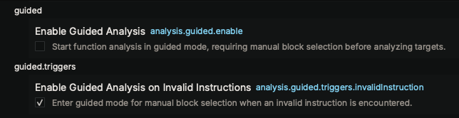

# Guided Analysis

## Overview

Guided Analysis provides granular control over which basic blocks are included or excluded from analysis. It is especially useful for analyzing obfuscated code, troubleshooting analysis issues, or focusing on specific execution paths while excluding irrelevant code.

## Modes of Operation

Guided Analysis operates in two primary modes:

**Automatic Mode**: Binary Ninja automatically enters guided analysis when encountering problems like invalid instructions. When this happens, direct branch targets are not followed and IL is generated only for the current set of blocks. If new information becomes available that resolves the original trigger condition, the function will reanalyze and may exit guided mode automatically.

**Manual Mode**: Manually enable guided analysis to precisely control analyzed blocks. Analysis begins with only the entry block, requiring explicit manual addition of further blocks.

## Enabling Guided Analysis

### Settings

- **`analysis.guided.enable`**: Manually start function analysis in guided mode (default: false)
- **`analysis.guided.triggers.invalidInstruction`**: Automatically enter guided mode when invalid instructions are encountered (default: true)

### Manual Activation

Set the `analysis.guided.enable` setting to `true` for a function. This will cause only the initial entry basic block to appear, requiring you to manually add additional blocks. It's also possible to enter guided mode by right-clicking on any existing block and using the Halt Disassembly action, discussed later.

## Working with Guided Analysis

### UI Indicators

When guided analysis is active, the UI will show a special indicator at the top of the function. This helps you identify when you are in guided mode and which blocks are available for analysis. The indicator includes a clickable link to exit guided mode, which disables the `analysis.guided.enable` setting and any trigger settings to prevent automatic re-entry into guided mode.

### Menu Actions

The guided analysis menu actions are only available in the **Disassembly** view. These actions control direct outgoing edges from basic blocks - indirect branches that use solvers and data flow analysis cannot be controlled through guided analysis.

- **Continue Disassembly**: Right-click on halted blocks to resume analysis of their branch targets
- **Halt Disassembly**: Right-click on any existing block to stop analysis of its branch targets. This allows you to focus on specific blocks without automatic expansion.

### Typical Workflow

1. Enable guided analysis (automatically triggered or manually enabled)
2. Use "Continue Disassembly" to add blocks whose branch targets should be analyzed
3. Use "Halt Disassembly" to remove blocks from having their branch targets analyzed
4. Iteratively refine which blocks have their branch targets analyzed based on your needs

## Key Use Cases

Guided Analysis is particularly valuable for:

### Obfuscated Code Analysis
- **Control flow obfuscation**: Navigate through flattened control flow by manually selecting legitimate paths
- **Junk code insertion**: Ignore irrelevant code branches that confuse automatic analysis
- **Anti-analysis techniques**: Bypass detection mechanisms by avoiding trigger blocks

### Malware Analysis
- **Anti-debugging evasion**: Avoid analysis-detection code paths
- **Payload extraction**: Focus on malicious functionality while ignoring wrapper code
- **Command & control**: Trace communication logic through specific execution paths

### Performance & Debugging
- **Large binary analysis**: Reduce analysis time by focusing on critical sections
- **Analysis issues**: Isolate problematic regions when Binary Ninja's automatic analysis fails
- **Incremental analysis**: Gradually expand analysis scope as understanding improves

## API Reference

Guided analysis can be controlled programmatically through multiple [Python APIs](https://api.binary.ninja/search.html?q=guided), supporting custom analysis scripts and plugins.
