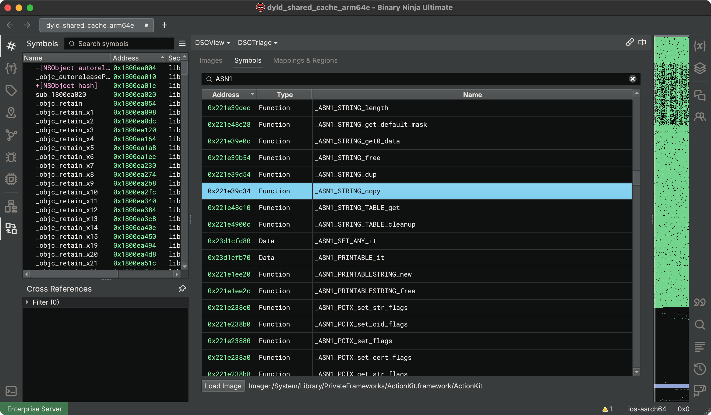

# Kernel Cache

Kernel Cache support in Binary Ninja provides you with tools to selectively load specific images, search for 
specific symbols, and follow analysis references between any images loaded from an `kernelcache` in one view.

Our support for `kernelcache` is largely open source. The supporting code can be found in our public API repository [here](https://github.com/Vector35/binaryninja-api/tree/dev/view/kernelcache). Instructions for setting up your development environment and building plugins like this yourself can be found in our [Developer Guide](../dev/plugins.md#writing-native-plugins). Contributions are welcome!

## Support Matrix

List of supported features for the given `kernelcache` targets:

| Platform | Arch   | Versions | Features                    |
|----------|--------|----------|-----------------------------|
| macOS    | x86_64 | 11 - 26  | Core, Objective-C           |
| macOS    | arm64  | 11 - 26  | Core, Objective-C           |
| iOS      | arm64  | 14 - 26  | Core, Objective-C           |

- **Core**: Core functionality, such as loading, navigating, and analyzing `kernelcache` files.
- **Objective-C**: Support for analyzing Objective-C information and symbols within the `kernelcache`.

???+ Note "Note"
    This plugin currently only supports `kernelcache` files in the `MH_FILESET` format.

## Obtaining a Kernel Cache

The `kernelcache` is a file that contains all of the kernel and its extensions used by modern Apple operating systems like macOS, iOS, and tvOS. These can be obtained directly from Apple, or with the help of a tool such as [`blacktop/ipsw`](#using-blacktopipsw).

A `kernelcache` should typically be automatically decompressed by Binary Ninja. If automatic decompression fails, Binary Ninja can still load 
caches decompressed by other tools as long as they are valid `MH_FILESET` Mach-O files. 

### Using `blacktop/ipsw`

Our recommended way to retrieve a `kernelcache` is using blacktop's [`ipsw` tool](https://github.com/blacktop/ipsw).

1. [Install blacktop/ipsw](https://github.com/blacktop/ipsw?tab=readme-ov-file#install)
2. Run `ipsw download ipsw --version [target iOS version] --device [target device model (e.g. iPhone10,3)]`
3. Run `ipsw extract --kernel [filename]`

### Local macOS Install

Getting to the local `kernelcache` on macOS depends on the specific version. Try some of the following:

  * `/System/Library/Kernel/`, which should have the `kernel`, but not necessarily the extensions
    * `/System/Library/Extensions/` should have each of the individual extensions
  * `/System/Library/PrelinkedKernels/`, which should have the full `kernelcache`, but may not exist on earlier versions of macOS
  * `/System/Library/Caches/com.apple.kernelcaches/`, which may be empty
  * `/System/Library/Caches/com.apple.kext.caches/Startup/kernelcache/`, which may be empty

## Interacting With a Kernel Cache

After opening a `kernelcache`, you will be provided a custom binary view. Due to the large size of these files, we do not load all the information into the binary view by default. Instead, this is done on-demand and selectively.

### Kernel Cache Triage (KCTriage)

The main way to interact with kernel cache information is through the Kernel Cache Triage view (KCTriage). This is the first thing you see when
opening a `kernelcache` and is how you add images to the actual binary view.

=== "Images"
    Shows a list of all images within the `kernelcache` and their virtual addresses.
    
    - Double click on an image to load
    - Select image(s) and click button "Load Selected" to load multiple images at once
    - Select image(s) and right click if you want more options for loading images

    

=== "Symbols"
    Shows a list of all exported symbols within the `kernelcache` and their virtual addresses.

    - Double click on a symbol to load the associated image, or use the "Load Image" button

    

### Scripting

Another way to interact with the kernel cache information is through the provided Python API, available in the `binaryninja.kernelcache` module.

```python
# Load the XNU kernel
from binaryninja import kernelcache
kc = kernelcache.KernelCache(bv)
kc.load_image_with_install_name('com.apple.kernel')
```

**Note:** *We do not support single-section loading at this time and can only load entire images.*
