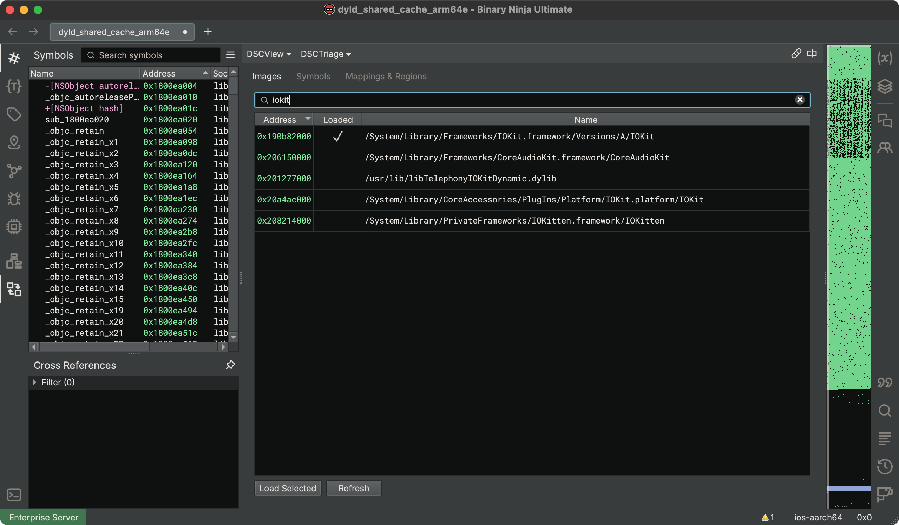
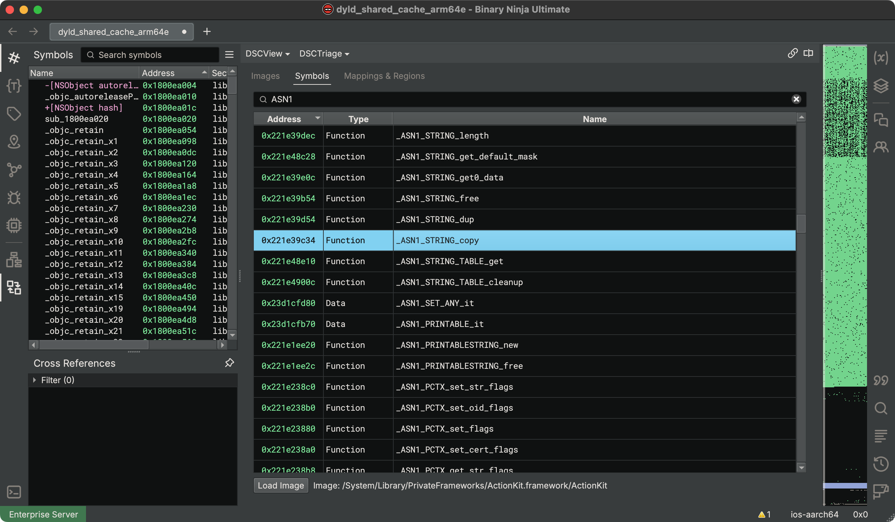
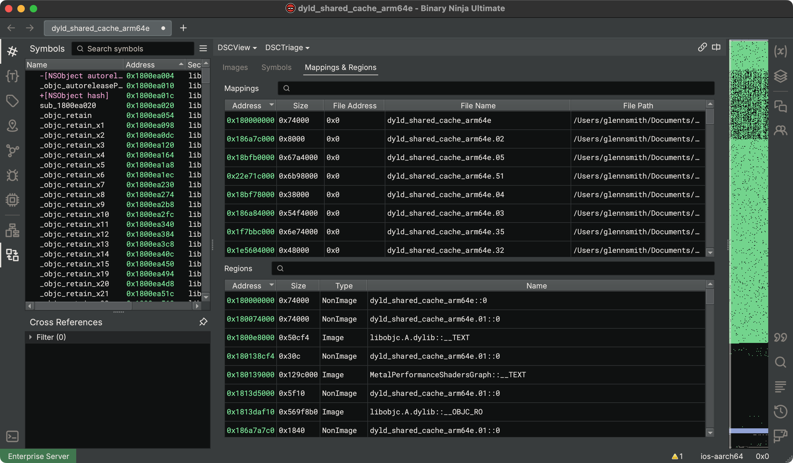

# Shared Cache

Shared cache support in Binary Ninja provides you with tools to selectively load specific images, search for specific symbols, and follow analysis references between any images loaded from a `dyld_shared_cache` in one view.

Our support for `dyld_shared_cache` is largely open source. The supporting code can be found in our public API repository [here](https://github.com/Vector35/binaryninja-api/tree/dev/view/sharedcache). Instructions for setting up your development environment and building plugins like this yourself can be found in our [Developer Guide](../dev/plugins.md#writing-native-plugins). Contributions are welcome!

## Support Matrix

List of supported features for the given shared cache targets:

| Platform | Arch   | Versions | Features                          | Notes                          |
|----------|--------|----------|-----------------------------------|--------------------------------|
| macOS    | x86_64 | 11 - 26  | Core, Objective-C, Workflow       |                                |
| macOS    | arm64  | 11 - 26  | Core, Objective-C, Workflow       |                                |
| iOS      | arm64  | 11 - 26  | Core, Objective-C, Workflow       |                                |
| iOS      | arm64  | 10       | Core, _~Objective-C_, Workflow    | Some objective-c parsing fails |
| iOS      | arm64  | 7 - 9    | _~Core_, _~Objective-C_, Workflow | Missing slide info adjustments |

> Features marked with **~** are partially supported and non-critical issues can occur.

- **Core**: Core functionality, such as loading, navigating, and analyzing `dyld_shared_cache` files.
- **Objective-C**: Support for analyzing Objective-C information and symbols within the shared cache.
- **Workflow**: Shared cache workflow that improves on the base Binary Ninja analysis with shared cache specific analysis.

## Obtaining a Shared Cache

The `dyld_shared_cache` is one or more files that contain all the shared libraries used by modern Apple operating systems (like macOS, iOS, and tvOS). These can be obtained directly from Apple, or with the help of a tool such as [`blacktop/ipsw`](#using-blacktopipsw).

### Using `blacktop/ipsw`

Our recommended way to retrieve a `dyld_shared_cache` is using blacktop's [`ipsw` tool](https://github.com/blacktop/ipsw).

1. [Install blacktop/ipsw](https://github.com/blacktop/ipsw?tab=readme-ov-file#install)
2. Run `ipsw download ipsw --version [target iOS version] --device [target device model (e.g. iPhone10,3)]`
3. Run `ipsw extract --dyld [filename]`

### Local macOS Install

The local shared cache on macOS is located at `/System/Volumes/Preboot/Cryptexes/OS/System/Library/dyld/`.

## Opening a Shared Cache

Binary Ninja currently only supports `dyld_shared_cache` files that have been extracted into a flat directory, so you will need to extract the IPSW (if there is one) first. After extraction, we expect files similar to the following:

  - `your_directory`
    - `dyld_shared_cache_arm64` (**Primary**)
    - `dyld_shared_cache_arm64.01` (Secondary, optional)
    - `dyld_shared_cache_arm64.02` (Secondary, optional)
    - `dyld_shared_cache_arm64.symbols` (Symbols, optional)

To load the shared cache, open the **Primary** file in Binary Ninja. In the example above this would be `dyld_shared_cache_arm64`.

???+ Danger "Warning"
    Opening any other file (e.g. `dyld_shared_cache_arm64.01`) will result in a partial shared cache, with only the information present in the file you opened.

### Project Support

Binary Ninja projects support `dyld_shared_cache` files. However, due to the nature of the project files not having a mappable path,
saving the analysis database (`.bndb`) in a separate directory will require you to select the primary shared cache file on
every open of the database. As a result, we advise keeping your analysis database in the same folder as your `dyld_shared_cache` files.

  - `your_project_folder`
    - `dyld_shared_cache_arm64` (**Primary**)
    - `dyld_shared_cache_arm64.01` (Secondary, optional)
    - `dyld_shared_cache_arm64.02` (Secondary, optional)
    - `dyld_shared_cache_arm64.symbols` (Symbols, optional)
    - `your_database.bndb` (This is recommended)

## Interacting With a Shared Cache

After opening a `dyld_shared_cache`, you will be provided a supercharged binary view: one which has information not only from
the opened primary file, but all the associated files (ex. `dyld_shared_cache_arm64.02`). Due to the large size of these
files, we cannot load all the information into the binary view. Instead, we do this selectively.

### Shared Cache Triage (DSCTriage)

The main way to interact with shared cache information is through the Shared Cache Triage view (DSCTriage). This is the first thing you see when
opening a `dyld_shared_cache` and is how you add images to the actual binary view.

=== "Images"
    Shows a list of all images within the `dyld_shared_cache` and their virtual addresses.

    - Double click on an image to load
    - Select image(s) and click button "Load Selected" to load multiple images at once
    - Select image(s) and right click if you want more options for loading images

    

=== "Symbols"
    Shows a list of all exported symbols within the `dyld_shared_cache` and their virtual addresses.

    - Double click on a symbol to load the associated image, or use the "Load Image" button

    

=== "Mappings & Regions"
    Shows information about the entry mappings and the cache regions.

    

### Scripting

Another way to interact with the shared cache information is through the provided Python API, available in the [`binaryninja.sharedcache`](https://github.com/Vector35/binaryninja-api/blob/dev/view/sharedcache/api/python/sharedcache.py) module.

Additionally, the `dsc` (or `shared_cache`) magic variable is available in the scripting console whenever a shared cache is opened.

```python
# Load all dependency images for the current loaded images
from binaryninja import sharedcache
for image in dsc.loaded_images:
    dependencies = dsc.get_image_dependencies(image)
    for dependency in dependencies:
        dep_image = dsc.get_image_with_name(dependency)
        if dep_image is None:
            continue
        dsc.apply_image(bv, dep_image)
```

???+ Note "Note"
    If you are processing `dyld_shared_cache` files headlessly, [`loader.dsc.autoLoadPattern`](settings.md) is a *very* useful setting to override. This is a regex you can have match all the files you *want* to analyze, skipping the need to use the Python or C++ API to load them manually.

## Glossary

### CacheEntry

A **CacheEntry** is a single file in the `dyld_shared_cache`. It contains images, symbols, and regions that collectively
represent a portion of its contents.

### CacheRegion

A **CacheRegion** is the logical segment of the `dyld_shared_cache` for which the memory is mapped into the `BinaryView`. It
represents distinct sections of the cache, so no region should be overlapping.

### CacheImage

A **CacheImage** is a single shared library within the `dyld_shared_cache`. It consists of sections (located within cache
regions) that include both code and data. This is analogous to a single Mach-O file.

### CacheSymbol

A **CacheSymbol** represents a symbol within the `dyld_shared_cache`, such as a function or data variable. It is *not* a view
symbol and is *not* directly available from the `BinaryView`. Instead, it is associated with the shared
cache data. Otherwise, we would be putting millions of symbols into the view and slowing down the core unnecessarily.
