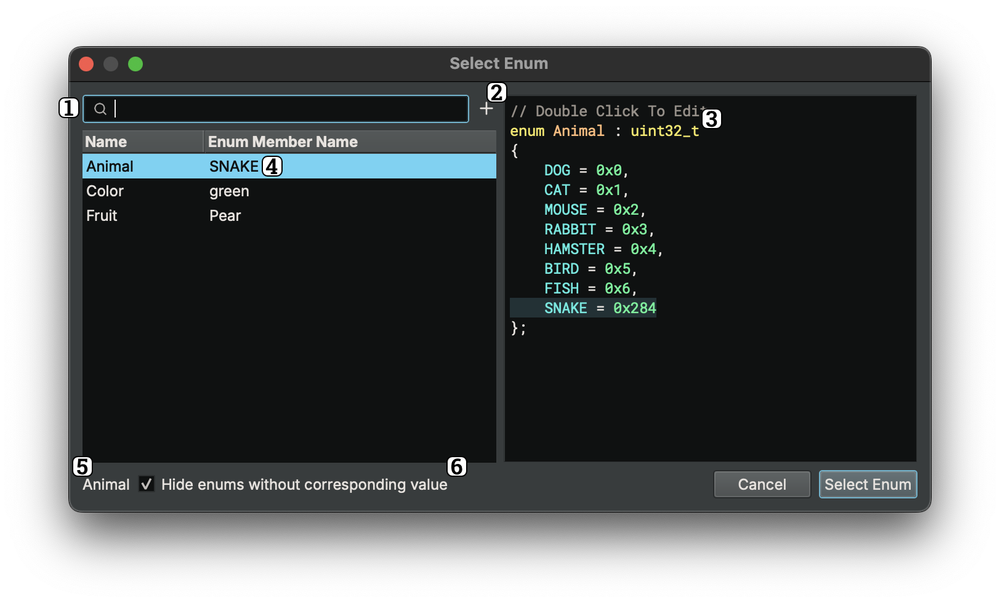
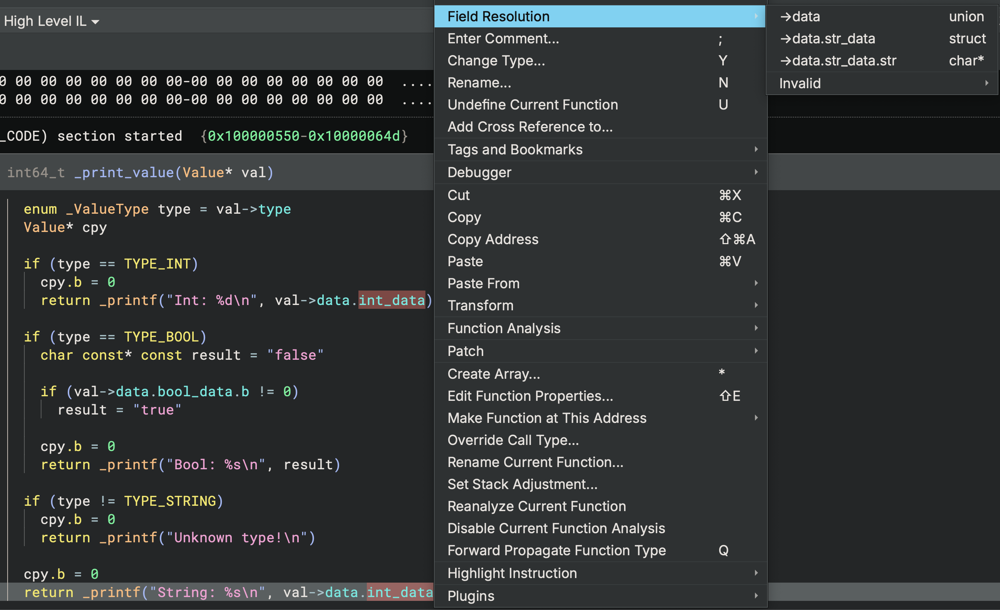
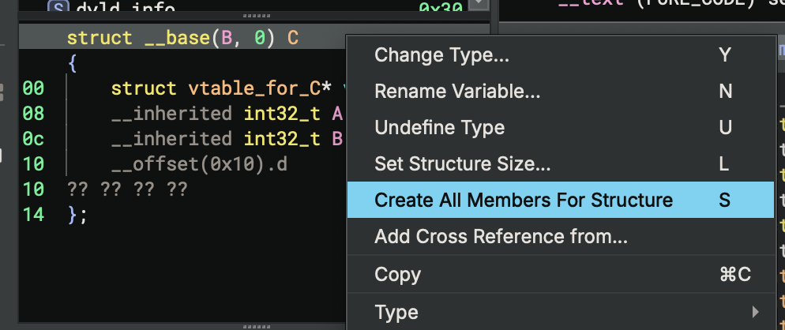

# Working with Types, Structures, and Symbols in Decompilation

There are two main ways to interact with types in decompilation or disassembly. The first is to use the [types view](basictypes.md#types-view), and the second is to take advantage of the [smart structures workflow](#smart-structures-workflow) or otherwise annotate types directly in a disassembly or IL view.

## Direct UI manipulation

The simplest way to directly manipulate types in disassembly is by viewing an existing variable or sequence of bytes in linear view and using the following hotkeys:

 - `1`, `2`, `4`, `8`: The number hotkeys will create a data variable at the current location if none exists, and then change the size of the variable to an integer in the size of bytes specified in the hotkey.
 - `d`: If you want to cycle through the different integer sizes, repeatedly pressing `d` has the same effect as pressing the numbers in order.
 - `-`: To quickly toggle integers between signed and unsigned integers, you can use the `-` hotkey.
 - `a`: This hotkey sets or creates the current variable to a character array up until and including the next null byte.
 - `o`: `o` will set or create the current variable to be a pointer reference.
 - `*`: If you have a selection of identical variables, `*` will convert them into an array of elements. If you have no selection, the "Create Array" dialog will be shown allowing you to create an array of specific type and count at the current location.

 - `s`: `s` is a magic hotkey described in the next section in greater detail
 - `m`: Used to apply an enumeration display at an integer (more details [below](#enumeration-selector))

 Note that you can apply these types to a region of memory as well, not just a single variable. So selecting a large block of bytes and pressing `2` `*` for example will create an array of `int16_t` sized elements.

## Enumeration Selector



The Enum Dialog, with a default hotkey of `m` can be used to both change the type for data variables, arguments, and local variables to an enum type and also to change the Display Type of constant integers to any matching enumeration members.

When used on an integer, all matching enumeration members will be shown.

1. Filter box to search large lists of matching enums
1. "New Enum" button to allow creation of a new enum
1. Enum preview (can also be used to edit an existing enum by double clicking a given line)
1. Currently selected enum/member (when the enum is selected, the preview will update, and you can also right-click here to change the type)
1. Name of currently selected enum
1. Checkbox (set by default) that hides enums with no matching members for the current integer.

However, in instances where the hotkey is used on other variables, the display will only be used to apply the enum type to the selection and does not allow editing.

## Union Field Resolution

When a type contains a union, any number of fields can resolve to the same offset. To account for this, the "Field Resolution" menu allows you to select which field to use at different instructions and propagate that type information through the rest of the function and to callee function parameter types. Consider the following type definition:

```C
typedef enum
{
  TYPE_INT,
  TYPE_BOOL,
  TYPE_STRING
} ValueType;

typedef struct
{
  ValueType type;
  union
  {
    struct { int i; } int_data;
    struct { unsigned char b; } bool_data;
    struct { char* str; } str_data;
  } data;
} Value;
```

This is a tagged union; there's an enum defining the different variants of the union, and then the actual union variants/members. The union should take up as much space as the largest variant, so in this case it will usually be 8 bytes (depends on the target machine's pointer width), but only one variant can occupy those bytes at a time.

When you apply a union type to a variable, you can use the "Field Resolution" option in the right-click menu to change which variant is used for a given instruction.



In the above screenshot the first if-block uses the `TYPE_INT` variant, and the second if-block uses the `TYPE_BOOL` variant. The final return statement is incorrectly showing the `int_data` type (it should be showing the `char*` one), and the "Field Resolution" option in the right-click menu is showing all possible fields that instance can resolve to, including options we've determined should be invalid. Simply select the correct option from the menu, and the output will be updated.

You can also access these options through the [command palette](../index.md#command-palette) by searching for "Field Resolution."

## Smart Structures Workflow



"Smart Structures" feature enables automatic creation of a structure and its members directly from the disassembly/IL view using the `s` hotkey.
It simplifies the traditional workflow in which the user first creates a type in the types view and then applies it to disassembly.
It works in the following ways:

| View               | Selection                                                    | Current Type         | Behavior                                                                          |
|--------------------|--------------------------------------------------------------|----------------------|-----------------------------------------------------------------------------------|
| Linear/Graph       | A variable                                                   | Not a struct/struct\* | Create structure dialog                                                           |
| Linear/Graph       | A variable that is the result an allocation routine          | Not a struct/struct\* | Create structure with allocation size                                             |
| Linear/Graph/Types | A variable, data variable, or a type name                    | struct/struct\*       | Create all members for structure                                                  |
| Linear/Graph/Types | A StructOffsetToken token, e.g., `__offset(0x18)`            | N/A                  | Create current member for structure                                               |

Here's a more detailed explanation about the various workflows:

1. In linear/graph view, if the selection is a variable that is not a structure, a dialog pops up and asks you to create a structure. You can specify the structure's name and size. There is also a checkbox that asks you whether the variable's type should be the structure itself or a pointer to the structure.
2. In linear/graph view, if the selection is a variable that is not a structure, and it happens to be the result of a memory allocation routine, e.g., `malloc`, a new structure will be created and its size is automatically determined (if possible). The variable's type will be a pointer to the structure.
3. In linear/graph/types view, If you select a variable whose type is a structure, or a pointer to a structure, BN will try to create all structure field at any offset that has been accessed in the code.
4. In linear/graph/types view, If you select a StructOffsetToken, BN will try to create a structure member at the current offset.

The automatic member creation mentioned in #3 and #4 takes into consideration both incoming and outgoing type information for the accessed offsets and selects the most confident one as the type for the offset.
When no type information can be used to create the structure member, we fall back to creating an integer type based on the size of accesses. For example, if we see an access of size 4, we will create an `int32_t`. In case there are different sizes of accesses, we do not create the member. You will need to examine the conflicting size information and decide how to create a member.


Consider the following example (created using [taped](../../files/taped) from the 2011 Ghost in the Shellcode CTF if you'd like to play along at home):

| Step                                                                                                                                                                                                                                               | Preview                                                    |
|----------------------------------------------------------------------------------------------------------------------------------------------------------------------------------------------------------------------------------------------------|------------------------------------------------------------|
| Go to address `0x8048e20` and switch to HLIL.                                                                                                                                                                                           |  |
| Select variable `var_18` and press `s`. <br/>Since `calloc` is a known allocation routine and the allocation size can be determined to be 0x30, a new structure, `struct_1` is created with size 0x30. |  |
| Select an offset, e.g., `__offset(0x4).d` and press `s`. A member will be automatically created.                                                                                                                             |  |
| Alternatively, select the `var_18` or the type name `struct_1` and press `s`. All members in the `struct_1` will be automatically created.                                                             |  |
| Viewing the automatically created structure members.                                                                                                                                                                                               |  |


The `s` hotkey also works when working with structures in the linear view. Its behavior differs based on the current selection:


| Selection                                                    | Behavior                                                                          |
|--------------------------------------------------------------|-----------------------------------------------------------------------------------|
| A single byte                                                | Create structure dialog                                                           |
| A range of bytes                                             | Create structure with selection size                                              |
| A range of bytes covering existing data variables            | Create structure with selection size and add existing data vars as struct members |


In linear view, if the selection is a single byte outside any function, it will pop up the create structure dialog. If the selection is a range of bytes, a structure of the selection size is created and the start of the selection. If the selection covers any existing data variables, these data variables will become members within the newly created structure.

This also works within data variables with structure type. For example, if the selection is a range of bytes within a structure, a new structure will be created within the existing structure.

## Special Characters

Many characters commonly used in function naming are not valid C characters. For example, `::` in C++ types, braces or brackets. While we use clang's type-parser for such APIs as [parse_type_string](https://api.binary.ninja/binaryninja.binaryview-module.html#binaryninja.binaryview.BinaryView.parse_type_string) (note there's also [another version](https://api.binary.ninja/binaryninja.typeparser-module.html#binaryninja.typeparser.TypeParser.parse_type_string) of that API independent of the BinaryView off of the TypeParser module).

To resolve this, we use `` ` `` (the backtick character) to enclose strings that should be treated as atomic units in the type-parser. You may notice this yourself if you create a struct with `:` in the name and then use `n` on the variable to see how it is escaped in the change name dialog.
