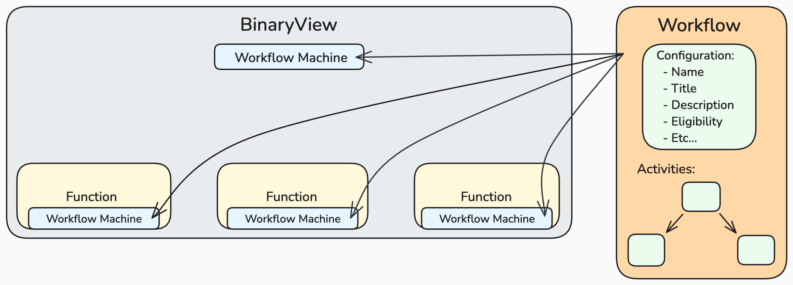
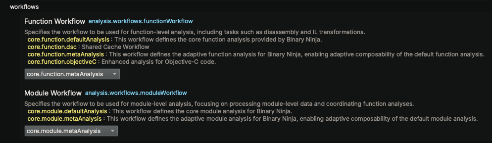
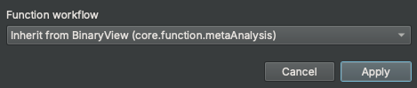
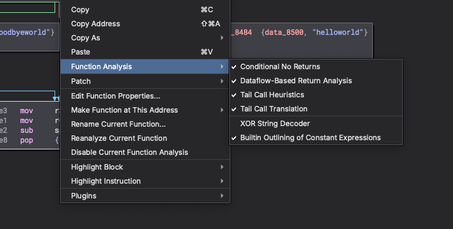
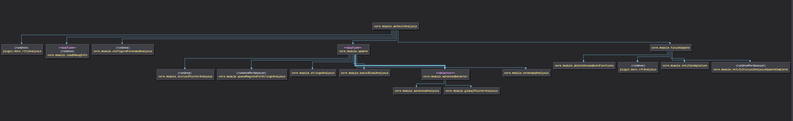

# Binary Ninja Workflows

## Introduction

Binary Ninja's **Workflows** provide a powerful and flexible framework for customizing and extending binary analysis. This framework allows you to tailor the analysis process to meet your specific needs. With Workflows, you can:

- **Customize Analysis Pipelines**: Define your own sequences of analysis steps, adjusting the order, inclusion, or exclusion of specific analyses to suit different binaries, architectures, or project requirements.

- **Gain Granular Control Over Analysis Stages**: Introduce additional, configurable analysis stages or modify existing ones to focus on areas of interest, optimize performance, or handle unique binary features.

- **Extend and Scale Analysis Capabilities**: Seamlessly integrate new analysis stages, plugins, or custom scripts, allowing the analysis pipeline to adapt as new challenges or requirements arise.

- **Utilize Concurrent and Asynchronous Execution**: Leverage advanced execution models like sub-flows and tasks to perform analyses concurrently, improving efficiency and enabling complex analysis strategies.

By leveraging Workflows, you gain unparalleled control over the decompilation and analysis process. This flexibility empowers you to perform in-depth, tailored binary analysis, adapting quickly to evolving needs and supporting future enhancements.

## Concepts

{ width="800" }

### Workflow

A **Workflow** in Binary Ninja defines the set of analyses to perform on a binary, including their dependencies and execution order. Workflows are represented as Directed Acyclic Graphs (DAGs), where each node corresponds to an **Activity** (an individual analysis or action). We have built an API around modifying and extending this structure, enabling you to tailor the decompilation and analysis process to your specific needs.

Workflows enable you to:

- **Control Execution Flow**: Precisely define the order in which analyses are executed, ensuring that all dependencies are respected.

- **Customize Analysis Composition**: Include, exclude, or modify analysis stages to focus on areas of interest or optimize performance.

- **Define Dependencies**: Clearly specify how different analyses depend on each other, facilitating complex analysis strategies.

- **Extend Functionality**: Seamlessly integrate custom analyses or third-party plugins into the analysis process.

There are two distinct types of Workflows:

**Module Workflows**:

  - Applied to `BinaryView` objects.
  - Perform analysis on the entire binary.
  - Coordinate high-level analysis tasks and oversee function-level analysis.

**Function Workflows**:

  - Applied to `Function` objects.
  - Perform analysis at the function granularity.
  - Pipelines can run concurrently and be executed independently of the Module Workflow.

### **Activity**

An **Activity** is an individual analysis or action within a Workflow, serving as the fundamental building block of the analysis process. Each Activity is responsible for a specific task and can be configured to define its execution behavior, dependencies, and eligibility criteria. Activities work together within the Workflow to carry out complex analysis tasks, with roles and configurations determining how they interact and execute. The Activity operates on an `AnalysisContext`, providing access to the binary data, analysis state, and transformation utilities.

### Workflow Machine

The **Workflow Machine** is the engine that manages and executes a Workflow. It controls the execution flow according to the Workflow's blueprint, handling states, commands, and activity eligibility. The Workflow Machine ensures that analyses are performed in the correct order and manages state transitions during the analysis process. We have built an API to interact with the Workflow Machine, allowing you to issue commands, query and modify state, and control activity eligibility.

In Binary Ninja, the terms **Workflow Machine** and **Pipeline** are used interchangeably to describe the execution of a Workflow on a particular target (such as a `BinaryView` or `Function`).

## Workflow Fundamentals

Configuring and customizing Workflows in Binary Ninja allows you to tailor the analysis process to your needs. This section covers key concepts and operations related to Workflow configuration and management.

### Workflow Selection

By default, `Function` and `BinaryView` objects get their assigned workflow from the settings system:

- **Function Workflow Setting**: `analysis.workflows.functionWorkflow`
- **Module Workflow Setting**: `analysis.workflows.moduleWorkflow`

These settings are configurable in the Binary Ninja Settings UI. Additionally, as new workflows are registered, the name and description are automatically added to the UI for easy selection.



These settings are scoped to the Resource level, meaning they are saved within each BinaryView. This allows each BinaryView to have its own unique workflow settings. Additionally, Binary Ninja supports function instance-level settings, enabling you to customize settings (and workflows) per function instance. In the UI, the *Edit Function Properties* dialog allows you to set the workflow for a specific function instance, as shown below:



As always, it's possible to interact with these settings programmatically using the Binary Ninja API. For example:

**Modify Workflow for a Function Instance**:

```python
# Function settings scope
Settings().get_string("analysis.workflows.functionWorkflow", current_function)
'core.function.metaAnalysis'
Settings().set_string("analysis.workflows.functionWorkflow", 'core.function.baseAnalysis', current_function)
Settings().get_string("analysis.workflows.functionWorkflow", current_function)
'core.function.baseAnalysis'

# BinaryView settings scope
Settings().get_string("analysis.workflows.functionWorkflow", bv)
'core.function.metaAnalysis'
Settings().get_string("analysis.workflows.moduleWorkflow", bv)
'core.module.metaAnalysis'
```

### Foundational Workflows

Binary Ninja provides a set of foundational workflows that serve as the basis for both module-level and function-level analysis. These workflows are designed to meet standard analysis needs while also serving as a starting point for customization.

**Immutable Base Workflows**

These workflows are immutable and represent the base analysis functionality in Binary Ninja. They provide a reliable baseline for analysis and cannot be altered directly:

- **Base Module Analysis** (`core.module.baseAnalysis`): Defines the base analysis tasks for module-level analysis on a `BinaryView` object. This workflow ensures consistent and thorough analysis of the entire binary.
- **Base Function Analysis** (`core.function.baseAnalysis`): Defines the base analysis tasks for function-level analysis. It provides a stable and reliable framework for disassembling and analyzing individual functions.

**Mutable Meta Workflows**
These workflows are clones of the default base workflows but are mutable, allowing for advanced customization and extensibility:

- **Meta Module Analysis** (`core.module.metaAnalysis`): A mutable version of the default module analysis workflow. It can be customized to add or remove analysis stages, modify dependencies, or integrate new analyses.
- **Meta Function Analysis** (`core.function.metaAnalysis`): A mutable version of the default function analysis workflow. It can be customized to extend or modify the analysis process for individual functions.

These foundational workflows are designed to be cloned and customized to create new workflows tailored to specific needs. By leveraging these base workflows, you can build upon existing analyses and extend the capabilities of Binary Ninja.

!!! note
	The workflow settings default to the meta workflows to facilitate seamless integration and customization by installed plugins or scripts. This approach ensures that multiple plugins can extend or modify the analysis pipeline without conflicting with the base workflows. The term "meta" reflects the workflow's role as a flexible and composable foundation, enabling collaborative customization while preserving the integrity of the default analyses.

!!! note
	Binary Ninja's analysis is structured through the Workflow system, providing immediate extensibility for interposing custom analysis steps. While most Activities within the Workflow represent specific analysis tasks, some serve purely to maintain the pipeline's functionality. These non-analysis Activities are transitional and will be phased out as we refine and modernize the underlying infrastructure.

Additionally, some Activities currently act as containers for multiple analysis steps. As we continue to evolve the foundational models, these composite Activities will be further decomposed and restructured to enhance clarity, flexibility, and granularity in the analysis pipeline.

### Workflow Cloning and Registration

Binary Ninja utilizes a copy-on-write mechanism to enable safe workflow customization. This approach allows you to create and modify workflows without impacting the integrity of registered workflows that may already be in use. When you clone a workflow, you generate a new, independent version that can be safely customized. Once the cloned workflow has been tailored to your needs, it can be registered under a new unique name, or—if the original workflow is mutable—under the same name to seamlessly replace it.

The process involves three steps:

1. **Clone** an existing Workflow.
2. **Modify** the cloned Workflow as needed.
3. **Register** the Workflow.

**Key Points**

- **Registered Workflows Are Immutable**: Once registered, workflows cannot be modified.
- **Workflows Require Unique Names**: Each workflow must have a unique identifier to prevent conflicts.
- **Naming Convention**: Currently, we use `core.function...` and `core.module...` for the foundational workflows. Custom workflows should use clear and descriptive names.

#### Querying Registered Workflows

You can query the list of all registered workflows or filter them by type using the API. This is useful for inspecting available workflows or ensuring your custom workflows are correctly registered.

```python
# List all Module and Function workflows
list(Workflow)
[<Workflow: core.function.baseAnalysis>,
<Workflow: core.function.dsc>,
<Workflow: core.function.metaAnalysis>,
<Workflow: core.function.objectiveC>,
<Workflow: core.module.baseAnalysis>,
<Workflow: core.module.metaAnalysis>]

# List all module workflows from the Settings API
Settings().query_property_string_list("analysis.workflows.moduleWorkflow", "enum")
['core.module.baseAnalysis', 'core.module.metaAnalysis']

# List all function workflows from the Settings API
>>> Settings().query_property_string_list("analysis.workflows.functionWorkflow", "enum")
['core.function.baseAnalysis', 'core.function.dsc', 'core.function.metaAnalysis', 'core.function.objectiveC']
```

Once you've queried the available workflows, you can create your own by cloning and modifying an existing workflow. Below are some simple examples that demonstrate how to modify module-level analysis.

#### Example: NOP'ing Module-Level Analysis

The following example demonstrates how to modify a module workflow by clearing all module-level analysis. This effectively disables module-level analysis while preserving the ability to analyze single functions at a time in the UI.

```python
# Clone the workflow
workflow = Workflow("core.module.metaAnalysis").clone()

# Optional: Visualize the workflow topology in the UI
workflow.show_topology()

# Get the root activity of the workflow
root = workflow.get_activity("core.module.baseAnalysis")

# Clear all activities in the workflow
workflow.clear()

# Re-register the root activity as the only activity in the workflow
workflow.register_activity(root)

# Register the modified workflow
workflow.register()

# Trigger an analysis update on the BinaryView and observe the no-op behavior
bv.update_analysis()
```

#### Example: Strings-Only Module-Level Analysis

This example demonstrates how to create a custom workflow that performs only the core strings analysis on a binary. While there are multiple ways to achieve this, the following method highlights the flexibility of the Workflow API.

```python
# Clone the workflow and give it a unique name
stringsWorkflowOnly = Workflow("core.module.metaAnalysis").clone("stringsAnalysisOnly")

# Retrieve relevant activities for strings analysis
root = stringsWorkflowOnly.get_activity("core.module.baseAnalysis")
sa1 = stringsWorkflowOnly.get_activity("core.module.queueRegionsForStringsAnalysis")
sa2 = stringsWorkflowOnly.get_activity("core.module.stringsAnalysis")

# Clear all existing activities
stringsWorkflowOnly.clear()

# Register only the strings analysis activities
stringsWorkflowOnly.register_activity(sa1)
stringsWorkflowOnly.register_activity(sa2)

# Register the root activity to include the strings analysis steps
stringsWorkflowOnly.register_activity(root, [sa1, sa2])

# Register the modified workflow
configuration = json.dumps({
	"title" : "Strings-Only Analysis",
	"description": "This workflow defines a strings-only analysis.",
	"targetType": "module"
})
stringsWorkflowOnly.register(configuration)

# Apply the custom workflow to a binary view and run the analysis
options = {"analysis.workflows.moduleWorkflow": "stringsAnalysisOnly"}
with load(".../helloworld", options=options) as view:
	print(view.strings)
```

#### Example: Custom Function-Level Analysis (XOR Decoder)

This example demonstrates how to customize the function-level analysis by adding a new activity to the meta function workflow. The new activity decodes XOR-encoded strings within the function, providing a custom analysis step that enhances the existing workflow.

```python
# Define the custom activity configuration
configuration = json.dumps({
	"name": "analysis.plugins.xorStringDecoder",
	"title": "XOR String Decoder",
	"description": "This analysis step transforms XOR-encoded strings within the current function.",
	"eligibility": {
		"auto": {
			"default": False
		}
	}
})

# Clone the meta function workflow for customization
workflow = Workflow("core.function.metaAnalysis").clone()

# Register a new activity
workflow.register_activity(Activity(
	configuration,
	action=lambda analysis_context: log_warn(
		f"Decoder running for function: {hex(analysis_context.function.start)}"
		# Insert decoder logic here :P
	)
))

# Insert the new activity before the "generateHighLevelIL" step
workflow.insert("core.function.generateHighLevelIL", ["analysis.plugins.xorStringDecoder"])

# Register the modified meta function workflow
workflow.register()
```

The example above demonstrates how the auto-generated control setting allows users to enable or disable an activity directly through the settings UI. This provides a convenient way to control the execution of custom analysis steps without modifying the code. As shown in the image below, the control setting automatically appears in a function's context menu under the *Function Analysis* group. By defaulting the setting to false, users can selectively enable the custom analysis step for specific functions as needed.

Please refer to the [Activity Eligibility](#activity-eligibility) section for more details on setting-based eligibility and control settings.

{ width="800" }

### Workflow Configuration

When registering a workflow, provide an optional JSON configuration that defines the workflow's properties, such as its `title`, `description`, and `targetType`. The `targetType` defaults to `"function"` if not specified. Below is an example of a workflow configuration:

```json
{
	"title": "Concise Workflow Title",
	"description": "A detailed description of the workflow's purpose.",
	"targetType": "module"
}
```

## Activity Fundamentals

An Activity represents a fundamental unit of work within a workflow. It encapsulates a specific analysis step or action as a callback function, which is augmented by a JSON configuration. This configuration defines the activity's metadata, eligibility criteria, and execution semantics, allowing it to seamlessly integrate into the workflow system.

### Key Characteristics

- **Shared Across Workflows**:
An Activity instance is shared among multiple workflows. As a result, the callback function must be re-entrant, ensuring that it can be safely invoked concurrently across different analysis contexts.

- **Callback Function with Context**:
The Activity's callback function operates on an `AnalysisContext`, which provides access to resources such as the binary data, analysis state, and transformation utilities. This allows the Activity to perform its specific task, whether analyzing,
modifying, or transforming the context.

- **Workflow-Defined Composition**:
The structural relationship of an Activity—whether it has children or serves as a child of another Activity—is defined by the Workflow. The Workflow determines the execution order and dependency graph, making Activities composable and adaptable to various analysis pipelines.

- **Declarative Metadata via JSON Configuration**:
	Each Activity is accompanied by metadata that provides essential information for its integration and execution within a workflow. The metadata structure ensures that Activities are not only functionally robust but also easy to manage and integrate into complex workflows. This metadata is defined through a JSON configuration and serves several purposes:

	- **Identification and Documentation**:
	Activities are uniquely identified by a name, with optional title and description fields to provide concise and detailed documentation. These fields make it easier to understand the purpose and function of each Activity.

	- **Role Definition**:
	The role field specifies the Activity's operational role within the workflow, such as `action`, `task`, or `subflow`. This helps determine how the Activity interacts with others in the workflow.

	- **Eligibility and Execution Semantics**:
	The eligibility field defines conditions under which the Activity is allowed to run. It supports a range of predicates, including automatic settings, single-run constraints, and custom logical operators, allowing for fine-grained control over execution.

### Activity Configuration

When registering an activity, provide a JSON configuration that defines the activity's properties, such as its `name`, `role`, `aliases`, `title`, `description`, and `eligibility`. The only required field is `name`, which uniquely identifies the activity. Below is an example of an activity configuration:

```json
{
	"name": "core.module.activityName",
	"role": "action",
	"title": "Activity Title",
	"description": "A detailed description of the activity's purpose.",
	"eligibility": {
		"runOnce": true,
		"auto": {}
	}
}
```

#### Activity Roles

Activities can have different roles, defining their behavior and how they interact within the Workflow:

- `action`: The default role; performs a specific task.
- `selector`: Contains child activities and uses an eligibility handler to determine which child activities to execute. This enables the ability to have a dynamic and reactive execution pipeline.
- `subflow`: Creates a new task context and asynchronously processes its workflow sub-graph on a new thread within the workflow machine. The subflow executes asynchronously from the requestor, allowing the original thread to return immediately. Within this context, multiple task actions can be enqueued, enabling extensive parallel processing. After completing its workflow sub-graph, it enters a Stall state, waiting for all its asynchronous task actions to complete. If the `continuation` property is set to true, the subflow re-evaluates its dependencies upon finishing all task actions and re-executes. This facilitates complex iterative processes that continue until convergence is achieved.
- `task`: Asynchronously processes the workflow graph on a new thread within the workflow machine. `task` activities enable the pipeline to execute asynchronously from its requestor. `task` activities require a task context to be present; if no task context exists, they execute immediately in the current thread.

!!! note
	Nested task contexts are not currently supported. We may consider adding this feature in the future if the need arises. Stated more simply, you may not embed a `subflow` within another `subflow`.

#### Activity Eligibility

Eligibility determines whether an Activity should execute, based on certain conditions or predicates. Key eligibility properties:

- `auto`: An object that automatically generates a boolean control setting and predicate. It includes one optional field:
	- `default`: The default boolean value for the auto-generated setting. If not provided, the default is `true`.
- `runOnce`: A boolean indicating whether the activity executes only once across all file/analysis sessions. Once the activity runs, its state is saved persistently, and it will not run again unless explicitly reset. This is useful for activities that only need to be performed once, such as initial setup tasks.
- `runOncePerSession`: A boolean indicating whether the activity executes only once within the current session. Its state is not saved persistently, meaning it resets when a new session begins. This is useful for tasks that should run once per analysis session, such as initialization steps specific to a particular execution context.
- `continuation`: A boolean indicating if a `subflow` is eligible for re-execution based on its eligibility logic. If not provided, the default is `false`.
- `predicates`: An array of objects defining the condition that must be met for the activity to be eligible to run.
	- `type` (required): A string indicating the type of predicate. Valid values:
		- `"setting"`: Evaluates the value of specific setting.
		- `"viewType"`: Evaluates the type of BinaryView.
	- `value` (required): The value to compare against, which can be one of the following types:
		- `string`
		- `number`
		- `boolean`
		- `array` of `string` (for `in` and `not in` operators)
	- `identifier` (required for `type: "setting"`): A string specifying the identifier of the setting to evaluate.
	- `operator` A string representing the comparison operator to use. Supported operators:
		- `==`: Equal to (default)
		- `!=`: Not equal to
		- `>`: Greater than
		- `>=`: Greater than or equal to
		- `<`: Less than
		- `<=`: Less than or equal to
		- `in`: Value is in a specified array
		- `not in`: Value is not in a specified array

### Defining Activities

An Activity must have at least a `name` and can include other properties like `role`, `aliases`, `title`, `description`, and `eligibility`. This section provides examples of defining activities with different roles and eligibility settings.

#### Activity with Run-Once Eligibility
- Activity executes only once. State is persistent across sessions.
	```python
	configuration = json.dumps ({
		"name": "core.module.activityName",
		"role": "action",
		"title": "Activity Title",
		"description": "A detailed description of the activity's purpose.",
		"eligibility": {
			"runOnce": True
		}
	})
	```
- Activity executes only once per session. State is not persistent across sessions.
	```python
	configuration = json.dumps ({
		"name": "core.module.activityName",
		"role": "action",
		"title": "Activity Title",
		"description": "A detailed description of the activity's purpose.",
		"eligibility": {
			"runOncePerSession": True
		}
	})
	```

#### Activity with Auto-Generated Control Setting Eligibility
- Activity automatically registers a control setting and predicate to determine eligibility. The setting is enabled by default.
	```python
	configuration = json.dumps ({
		"name": "core.module.activityName",
		"role": "action",
		"title": "Activity Title",
		"description": "A detailed description of the activity's purpose.",
		"eligibility": {
			"auto": {}
		}
	})
	```

- Activity automatically registers a control setting and predicate to determine eligibility. The setting is disabled by default.
	```python
	configuration = json.dumps ({
		"name": "core.module.activityName",
		"role": "action",
		"title": "Activity Title",
		"description": "A detailed description of the activity's purpose.",
		"eligibility": {
			"auto": {
				"default": False
			}
		}
	})
	```

!!! note
	Auto-generated control settings provide an efficient way to offer granular control over activity execution. Currently, the setting identifier is derived automatically from the activity name. In the core system, these generated control settings are organized under the *Core Analysis* settings group, using the prefixes core.function.* and core.module.*. However, this structure will evolve as we reconcile existing analysis settings with the new workflow system.

#### Activity with Setting-Based Eligibility
- Activity executes based on the value of an existing setting.
	```python
	configuration = json.dumps ({
		"name": "core.module.activityName",
		"role": "action",
		"title": "Activity Title",
		"description": "A detailed description of the activity's purpose.",
		"eligibility": {
			"predicates": [
				{
					"type": "setting",
					"identifier": "analysis.linearSweep.autorun",
					"value": True
				}
			]
		}
	})
	```

!!! note
	Linking activity eligibility to an existing setting (or another activity's automatically generated control setting) enables the management of activities as groups. This allows multiple activities to be enabled or disabled with a single setting, simplifying control and enhancing coordination.

#### Activity with View-Type Eligibility
- Activity executes based on all view types except 'Raw' BinaryViews.
	```python
	configuration = json.dumps ({
		"name": "core.module.activityName",
		"role": "action",
		"title": "Activity Title",
		"description": "A detailed description of the activity's purpose.",
		"eligibility": {
			"predicates": [
				{
					"type": "viewType",
					"value": ["Raw"],
					"operator": "not in"
				}
			]
		}
	})
	```

#### Activity with Compound Eligibility
- Activity executes based on multiple predicates.
	```python
	configuration = json.dumps ({
		"name": "core.module.activityName",
		"role": "action",
		"title": "Activity Title",
		"description": "A detailed description of the activity's purpose.",
		"eligibility": {
			"auto": {},
			"runOnce": True,
			"predicates": [
				{
					"type": "viewType",
					"value": ["COFF", "PE"],
					"operator": "in"
				},
				{
					"type": "setting",
					"identifier": "analysis.windows.forceAnalysis",
					"value": True
				}
			],
			"logicalOperator": "or"
		}
	})
	```

!!! note
	Compound eligibility predicates provide a powerful mechanism for defining complex conditions that determine activity execution. By combining multiple predicates, you can create sophisticated eligibility rules that adapt to various scenarios and requirements. By default, compound predicates are evaluated using the logical AND operator. The optional `logicalOperator` field controls how to combine multiple predicates. Supported values are `and` (default) and `or`.

### Activity Eligibility Overrides

The **Workflow Machine** includes an override system that allows you to manually force activities to be either eligible or ineligible. This feature is particularly useful for debugging, testing, or customizing the analysis pipeline. Additionally, the override system is used to implement run-once functionality for specific activities.

 **Override States**:

  - **Enabled**: Forces the activity to be eligible.
  - **Disabled**: Forces the activity to be ineligible.
  - **Cleared**: Removes any override, returning to default eligibility.

!!! note
	Overrides can be managed either visually through the topology graph or programmatically via the API. Details on both approaches are provided in the following sections.

## Workflow Machine Fundamentals

The **Workflow Machine** is the core engine that manages and executes workflows. It controls the flow of analysis, ensuring that activities are executed in the correct order and respecting their dependencies. The Workflow Machine also handles activity eligibility, state transitions, and execution semantics, providing a robust and flexible framework for analysis.

There is an API to interact directly with the Workflow Machine, allowing you to issue commands, query state, and control activity eligibility.

!!! note
	This API is only available in **Commercial** and above product editions. However, the Workflow Machine API is not required for the general use case of authoring or using workflows.

### WorkflowMachine CLI Commands

You can interact with the `WorkflowMachine` using the CLI for debugging purposes:

 **Start the CLI**:

```python
bv.workflow.machine.cli()
```

**Available Commands**:

```
abort       configure  dump    halt  log      override  reset   run     step
breakpoint  disable    enable  help  metrics  quit      resume  status
```

!!! note
	The CLI provides a convenient way to issue commands, query status, and manage the workflow machine interactively. It is particularly useful for debugging, testing, and exploring the behavior of the workflow machine during execution. It's currently still under development, and additional features, enhancements, and documentation are planned.

## Workflow Topology

The **Workflow Topology Graph** visually represents the workflow's structure, helping you explore and manage the analysis pipeline interactively. It includes two modes of visualization:

- **Composite View**: Displays the workflow as a whole, emphasizing the overall structure and dependencies between activities.

- **Sequential View**: Focuses on the workflow's execution order, presenting activities as a sequence.

Both modes offer a comprehensive way to understand the workflow's design and execution flow, enhancing your ability to customize and optimize the analysis process. Below is an example of a composite view of a workflow:

{ width="1200" }

The `show_topology()` function offers two distinct ways to visualize a workflow:

**Static Workflow View**:

```python
Workflow("core.module.metaAnalysis").show_topology()
```

This command displays a static view of the workflow, showcasing its predefined structure. It highlights the configured activities and their relationships, providing a clear overview of the workflow's design. The topology graph is reactive, meaning if you're actively modifying the workflow, the graph will update in real-time to reflect the changes.

**Dynamic Workflow View**:

```python
# The Module Workflow is bound to a BinaryView instance and its Workflow Machine
bv.workflow.show_topology()

# The Function Workflow is bound to a Function instance and its Workflow Machine
current_function.workflow.show_topology()
```

These commands build upon the static view by incorporating real-time dynamic state information. It provides additional insights such as the current eligibility of activities, override states, and other runtime data. This enhanced view offers a more detailed and interactive perspective, making it invaluable for monitoring and debugging during execution.

!!! note
	Using the dynamic view, the eligibility of activities can be toggled interactively. Currently, this behavior is tied to the double-click event on an activity node. This feature allows you to quickly cycle through different eligibility states, enabling rapid testing and validation of activity configurations.

## Advanced Topics (Coming Soon)

This section covers advanced topics related to Workflows, Activities, and the Workflow Machine. It explores emerging concepts, best practices, and strategies for optimizing and extending the analysis pipeline.