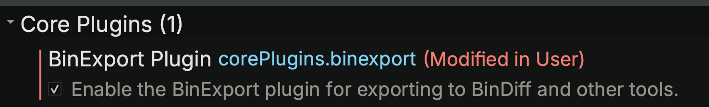
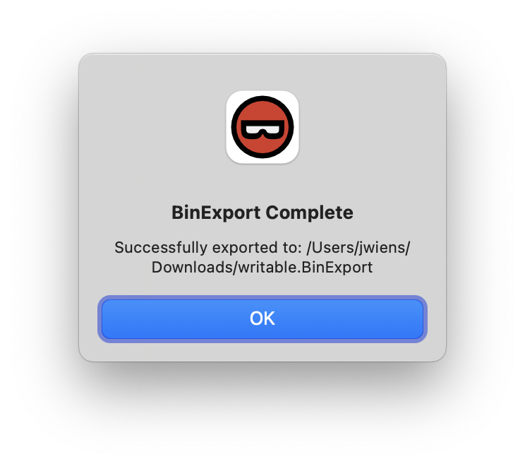
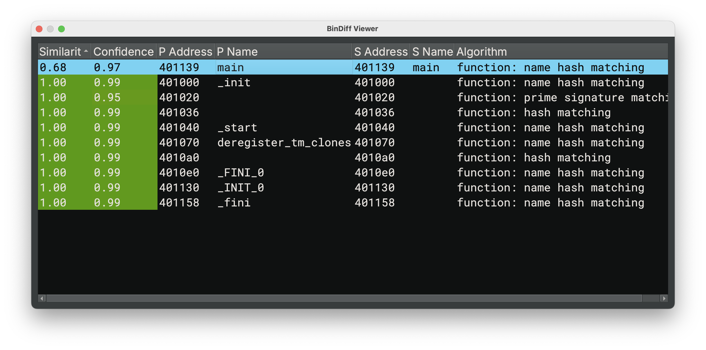

# BinExport / BinDiff

BinExport is a [plugin written by Google](https://github.com/google/binexport) (originally [Zynamics](https://www.zynamics.com/) before their acquisition) to create files used for the [BinDiff](https://github.com/google/bindiff) differential analysis tool.

## Usage

### Enable the Experimental Plugin

{ width="400" }

The initial release of this plugin is **EXPERIMENTAL** due to being finished too close to a stable release for better testing. As such, it is disabled by default. To enable it, search settings for "binexport", enable the plugin, and restart Binary Ninja.

### Activation

{ width="300" }

To trigger the plugin and create a `.binexport` file for the current binary, use either the `Plugins` / `BinExport` menu, or the `BinExport` action in the [command-palette](./index.md#command-palette).

A file dialog will open, defaulting to the same file name and location (without the original file extension -- a new file extension will automatically be appended of .BinExport`)

If successful, two more dialogs will show up. One warning that the export can take some time for large files, and a second confirming success.

### What Next?

After creating the before and after `.BinExport` files you wish to analyze, you'll want to install [BinDiff](https://github.com/google/bindiff), and run it on the CLI or the GUI to create a `.bindiff` result database.

```sh
$ bindiff writable.BinExport writable2.BinExport
BinDiff 7 (@377901646, Jun  7 2021), (c)2004-2011 zynamics GmbH, (c)2011-2021 Google LLC.
Setup: 0s
primary:   writable: 11 functions, 2 calls
secondary: writable2: 11 functions, 2 calls
Matching: 0s
matched: 11 of 11/11 (primary/secondary, 11/11 non-library)
call graph MD index: primary   0.264073
                     secondary 0.264073
Similarity: 99.2002% (Confidence: 99.2002%)
Writing results: 0.0s
```

The resulting `.BinDiff` file can either be opened in the BinDiff Java GUI, or directly in Binary Ninja directly using the [BD Viewer](https://github.com/PistonMiner/binaryninja-bindiff-viewer) plugin (available via the [Plugin Manager](./plugins.md)) and also supports porting symbols from one matched database to another.

{ width="800" }
_BD Viewer Plugin_

## Changes / Fork

All changes made to the original plugin to be able to ship it as a plugin directly with the product are maintained in the [Vector 35 fork](https://github.com/Vector35/binexport) and are [released](https://github.com/Vector35/binexport/blob/main/LICENSE) under the same Apache 2.0 license as the [original plugin](https://github.com/google/binexport/blob/main/LICENSE). Please do not file issues related to anything on that repo except for specific Binary Ninja UI functionality or changes.
