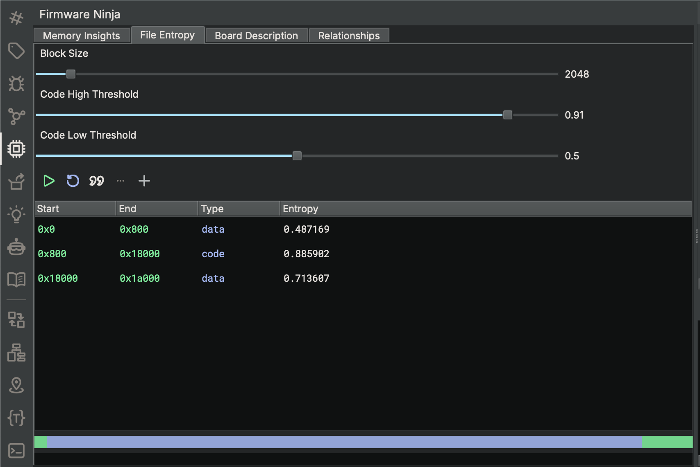
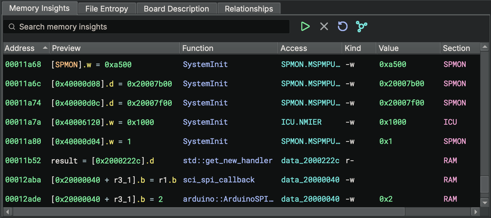
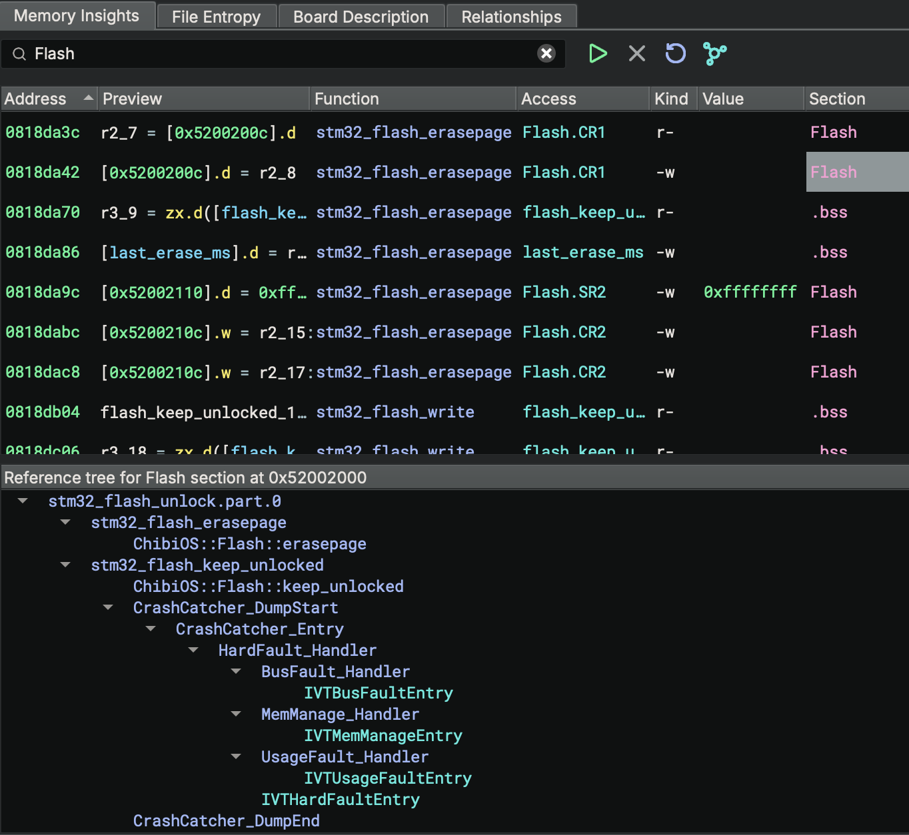
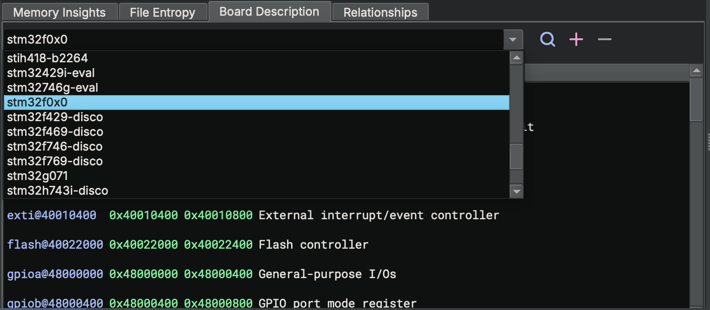
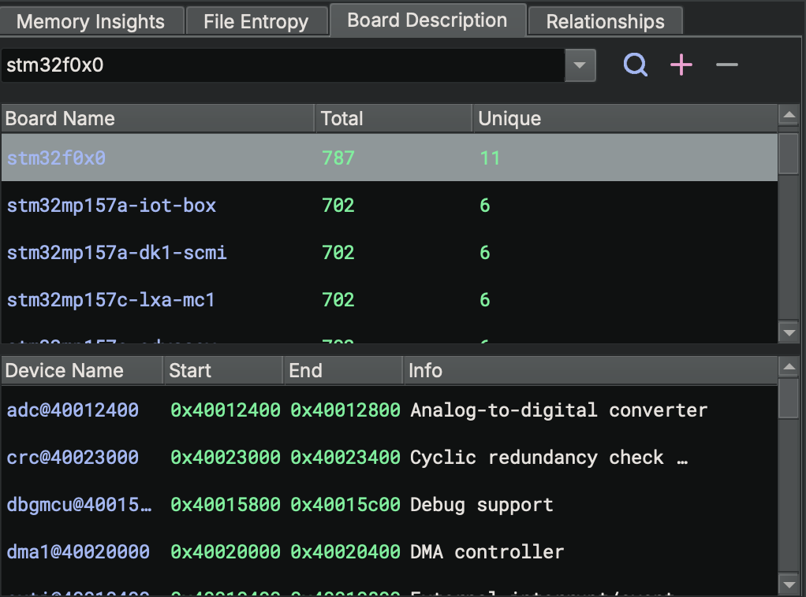
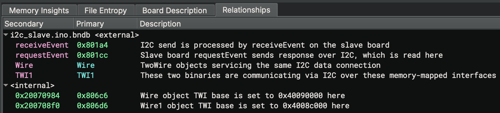
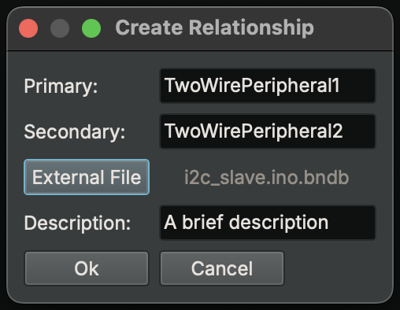

# Firmware Ninja

Firmware Ninja (FWN) speeds up firmware analysis by offering analytical capabilities tailored to the complexities of
embedded reverse engineering.

???+ Important "Supported Editions"
    Firmware Ninja is only available in the Ultimate edition of Binary Ninja

## Entropy Analysis

Firmware Ninja provides an entropy analysis tool that aids in triaging raw binaries to identify code and data regions
and to discover "interesting" blobs. This tool can also be used to quickly create sections within file-backed memory
regions.

### Identifying Memory Regions

To run entropy analysis, open the Firmware Ninja sidebar widget, navigate to the `File Entropy` tab, and click the
`Run Analysis` button.

{ width="600" }

Adjust the block size and code threshold sliders to change the granularity of the entropy analysis. The block size
determines the size of the blocks that the file is divided into for entropy calculations. The code threshold
determines the entropy values that are considered to potentially be code.

By default, FWN entropy analysis runs a strings heuristic to identify data regions. This heuristic overrides the
region type from code to data for regions that fall in the code entropy threshold, but have a high density of strings.
This heuristic can be disabled by clicking the `Disable Strings Heuristic` button.

FWN entropy analysis also identifies padding and compressed regions. Padded regions can be ignored by clicking the
`Ignore Padded Regions` button. When ignored, the padding regions are combined with adjacent data regions.

### Creating Sections

To create sections, shift-click and select one or more rows in the entropy table, then right-click and select
`Create Section from Selected Regions`. The top color-coded bar below the entropy table visualizes memory regions
identified by entropy analysis, while the bottom bar displays the sections created within the file-backed memory.

{ width="600" }

## Memory Insights

Firmware Ninja’s memory insights tool detects accesses to static memory regions including memory-mapped I/O and RAM.
It employs multiple heuristics to identify hardware interaction patterns such as loads and stores to external memory,
repeated reads and writes to specific locations, and other indicative behaviors.

### Running Analysis

To run memory insights analysis, navigate to the `Memory Insights` tab and click the `Run Analysis` button. Memory
insights analysis can take some time to complete, depending on the size of the binary.

{ width="600" }

Use the search bar to filter results by address, value, function name, or section name. Results can also be ordered by
clicking the column headers. A description of each column is provided in the table below:

| Column | Description |
|---|---|
| **Address** | The address of the instruction accessing memory |
| **Preview** | A preview of the instruction |
| **Function** | The function containing the instruction |
| **Access** | The address being accessed |
| **Kind** | The type of access (read/write) |
| **Value** | The value being written (if determined) |
| **Section** | The section containing the address being accessed |

### Generating Reference Trees

Reference trees visualize which functions and data variables are capable of accessing a specific location in the binary
and how they are related. To generate reference trees, click the `Show/Hide Reference Tree` button and select a
cell in the `Section`, `Function`, or `Access` column of the memory insights results table.

{ width="600" }

Reference trees can be constrained by the value written to the accessed location. To do this, select a cell in the
`Value` column containing a constant value. Only reference trees that write that value to the accessed location will be
displayed.

## Board Description

Firmware Ninja bundles board descriptions for several embedded platforms. These descriptions provide information about
the hardware peripherals, including the start address and size of memory-mapped I/O and SRAM regions. These descriptions
can be used to rapidly create sections to represent memory regions that are not backed by the binary.

### Selecting a Board

If you know the target board, navigate to the `Board Description` tab and select the board in the drop-down menu.

{ width="600" }

Once a board is selected, information about each of the board's hardware peripherals is displayed. To create memory
regions for the peripherals, shift-click and select one or more rows in the table. Right-click and select `Create
memory regions for selected devices`.

???+ Important "Loading an SVD File"

    Binary Ninja can load System View Description (SVD) files and create memory regions for peripherals as well as create
    and name data variables to represent control and status registers. SVD files typically contain more information than
    bundled board descriptions. It is recommended to use SVD files when available. To load an SVD file, click `Plugins ->
    Load SVD File`.

### Auto Identifying a Board

{ width="400" }

If you are unsure of the target board, click the `Auto Identify Board` button. Firmware Ninja attempts to identify the
target board by comparing access locations found in the memory insights analysis against known memory-mapped I/O
regions in the available board descriptions.

### Creating Custom Devices

Firmware Ninja doesn't contain a board description for every platform in existence. Users can define custom devices by
clicking the `Add Custom Device` button. This opens a dialog where you can enter the name, start address, end address,
and a description of the device. After clicking "Ok", the device is added to the table.

## Relationships

Firmware Ninja's relationships tool provides a way to model both inter-binary and intra-binary relationships between
functions, data variables, symbols, and memory addresses. This tool facilitates navigation between related items
internal to a single binary or across multiple binaries in a Binary Ninja project.

{ width="600" }

### Creating a Relationship

{ width="300" }

To create a new relationship, right-click and select `Create relationship`. This opens a dialog where you can define
the primary entity, secondary entity, and description of the relationship.

The primary entity is the symbol or address of the first item in the relationship. The primary entity must be in the
currently opened binary. The secondary entity is the symbol or address of the item that is related to the primary
entity. The secondary entity can be in the currently opened binary or in an external Binary Ninja Database (bndb) file
contained in the current project. To specify that the secondary entity is in an external bndb, click the
`External File` button and select the bndb file.

???+ Important "External Relationship Criteria"

    If the current binary is not part of a Binary Ninja project, the `External File` button will be disabled, providing
    only the option to define internal relationships.

Click populated cells in the `Primary` or `Secondary` columns to navigate between related items. If the related
item is in an external bndb, the external bndb will be opened in a new tab and the UI will navigate to the location of
the item.

### Deleting a Relationship

To delete a relationship, right-click on the relationship in the table and select `Delete Relationship`.
