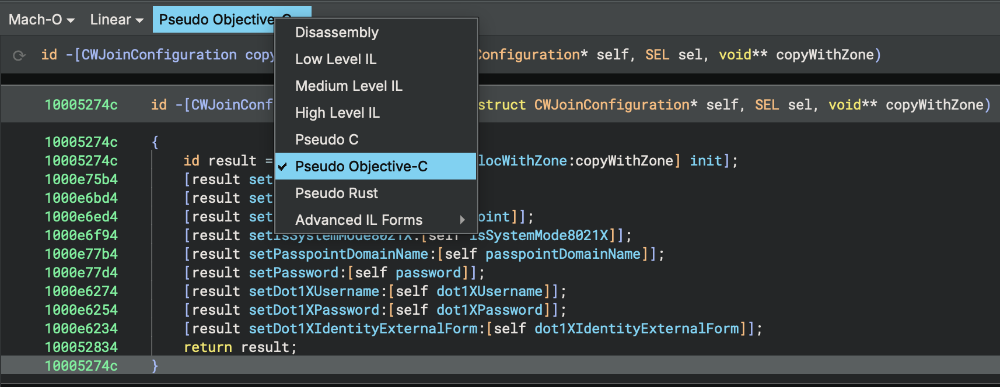

# Objective-C

Binary Ninja ships with built-in functionality for assisting with Objective-C analysis. 
A brief summary of the features offered is as follows:

- **Name and Type Recovery.** Using runtime information embedded in the
  binary, Binary Ninja automatically applies names and type information to
  Objective-C functions.

- **Structure Markup.** Data variables are automatically created for Objective-C
  structures such as classes and method lists to enable easy navigation.

- **String Literal Handling.** Data variables are automatically created for all
  `CFString` or `NSString` instances present in the binary.

- **Automatic Call Type Adjustments.** Binary Ninja automatically infers the number of arguments and their names
  for individual calls to `objc_msgSend` and `objc_msgSendSuper2`. Argument names are derived from the selector
  components, and argument types are inferred in limited cases.

- **Pseudo Objective-C Language.** Decompiled code can be displayed using a _Pseudo Objective-C_
  language syntax. This renders `objc_msgSend` and other Objective-C runtime calls using the
  `[receiver message:argument other:argument2]` syntax found in Objective-C source code.
  Additionally, literals such as `CFString` or `NSString` are displayed inline as `@"string"`.

- **Direct Call Rewriting.** Calls to `objc_msgSend` can be rewritten to be direct calls to
  the first known method implementation for that selector.
  
  This is disabled by default as it will give potentially confusing results for any selector
  that has more than one implementation or for common selector names. That said, some users may
  still find it to be useful. It can be enabled via `analysis.objectiveC.resolveDynamicDispatch`
  setting.

## Usage

Objective-C metadata will be automatically processed when you open a Mach-O or DYLD shared cache binary in Binary Ninja.

The Pseudo Objective-C Language representation is available via the language pop-up menu at the top of Linear and Graph views:

