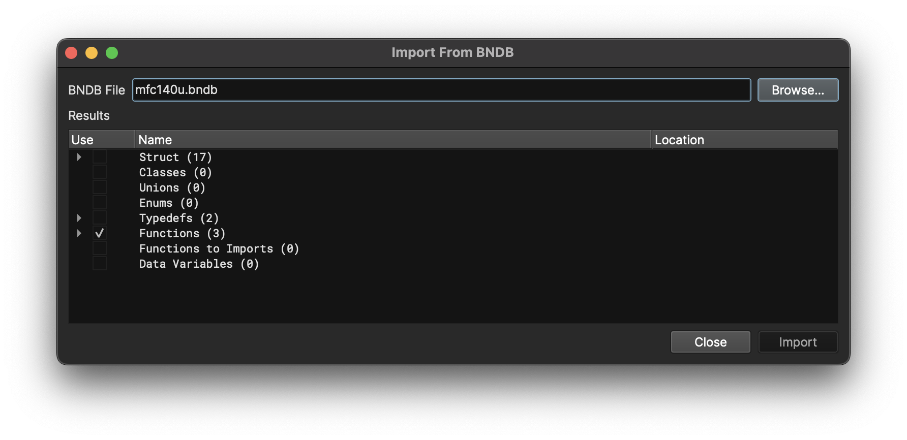
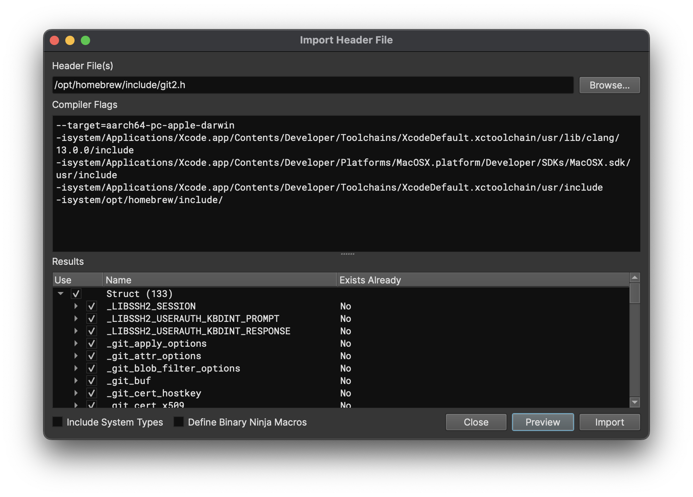

# Importing Type Information

Type information can be imported from a variety of sources. If you have header files, you can [import a header](#import-header-file). If your types exist in an existing BNDB, you can use [import from a bndb](#import-bndb-file). With the introduction of [type archives](typearchives.md) we recommend migrating away from importing via BNDB to type archives as they allow types to remain synced between different databases.

## Import BNDB File

The Import BNDB File feature imports types from a previous BNDB into your currently open file. In addition, it will apply types for matching symbols in functions and variables. Import BNDB *will not* port symbols from a BNDB with symbols to one without -- the names must already match. Matching functions and porting symbols is beyond the scope of this feature.



### Usage

To use this feature select `Import From BNDB` from the `Analysis` menu, use the [command palette](../index.md#command-palette), or [bind a hotkey](../index.md#custom-hotkeys) and select the BNDB you'd like to import. Wait for the BNDB to load then you'll be presented with a list of things to import.

* Types - Various types to be imported from the source BNDB
* Functions - Attempt to find target functions whose symbol already matches the symbol of the source BNDB and apply their type
* Function to Imports - Attempt to find target Imports whose symbol matches the Functions symbols in the source BNDB and apply their type
* Data Variables - Attempt to find target DataVariables with symbols that match DataVariables in the source BNDB and apply their type

This feature enables a number of workflows:

### Porting Analysis Between Target Versions

If you're working with version 1 of a file which has symbols and you now want to port your work over to version 2 (as long as they both have symbols). This isn't going to be perfect as this feature isn't interactive and doesn't take into account changes in parameter counts or ordering, so *use this with caution*.

### Quickly Defining Externs

If you have a binary with externs which don't have TypeLibraries this can allow you to quickly import them (and their types) from another source, this is especially effective when you have debug information for the dependent libraries

## Import Header File

If you already have a collection of headers containing types you want to use, you can import them directly. You can specify the compiler flags that would be used if a compiler were compiling a source file that uses this header. Specifically this means you can/should specify:

- `-isystem<path>` for various system header paths
- `-I<path>` for various user header paths
- `-D<macro>=<value>` for macro definitions
- `-x c -std=c99` to specify C99 mode
- Other Clang-compatible command-line flags are accepted (eg `-fms-extensions`, `-fms-compatibility`, etc)

You can specify that types from system headers, accessed via `#include <header.h>`, will be in the results. Otherwise, only files from user headers, accessed via `#include "header.h"` will be used.

You can also specify Define Binary Ninja Macros, which makes the type parser include the various parser extensions that Binary Ninja allows in the Type View editors, eg `__packed`, `__padding`, `__syscall`, etc. You probably only want to use this option when importing a header file exported using [Export Header File](#export-header-file). 

After specifying the file(s) and flag(s), pressing Preview will give a list of all the types and functions defined in the file(s). You may check or uncheck the box next to any of the types/functions to control whether they will be imported to your analysis.

If there were any parse errors, those will be shown instead of a list of types. Generally speaking, what this means is you're missing either header search paths or compile definitions. See the section below on [finding system headers](#finding-system-headers).

After pressing Import, all the checked types/functions will be added to your analysis. Imported types will override any existing types you had defined so they are disabled by default as indicated via the `Exists Already` column. Imported functions will replace signatures of any functions in your analysis whose name matches signatures found in the header. 



### Finding System Headers

Since you need to specify the include paths for system headers, you will need to deduce them for the target platform of your analysis. Here are a few tricks that may help:

#### Systems with GCC/Clang (macOS, Linux, etc)

On these systems, you can run a command to print the default search path for compilation:

    gcc -Wp,-v -E -
    clang -Wp,-v -E -

For the directories printed by this command, you should include them with `-isystem<path>` in the order specified.

For example on macOS, with Xcode 13:

    $ clang -Wp,-v -E -
    clang -cc1 version 13.0.0 (clang-1300.0.29.3) default target arm64-apple-darwin21.6.0
    ignoring nonexistent directory "/Applications/Xcode.app/Contents/Developer/Platforms/MacOSX.platform/Developer/SDKs/MacOSX.sdk/usr/local/include"
    ignoring nonexistent directory "/Applications/Xcode.app/Contents/Developer/Platforms/MacOSX.platform/Developer/SDKs/MacOSX.sdk/Library/Frameworks"
    #include "..." search starts here:
    #include <...> search starts here:
     /usr/local/include
     /Applications/Xcode.app/Contents/Developer/Toolchains/XcodeDefault.xctoolchain/usr/lib/clang/13.0.0/include
     /Applications/Xcode.app/Contents/Developer/Platforms/MacOSX.platform/Developer/SDKs/MacOSX.sdk/usr/include
     /Applications/Xcode.app/Contents/Developer/Toolchains/XcodeDefault.xctoolchain/usr/include
     /Applications/Xcode.app/Contents/Developer/Platforms/MacOSX.platform/Developer/SDKs/MacOSX.sdk/System/Library/Frameworks (framework directory)
    End of search list.

From this example, the flags would be: (note: not including the framework directory line)

    -isystem/usr/local/include
    -isystem/Applications/Xcode.app/Contents/Developer/Toolchains/XcodeDefault.xctoolchain/usr/lib/clang/13.0.0/include
    -isystem/Applications/Xcode.app/Contents/Developer/Platforms/MacOSX.platform/Developer/SDKs/MacOSX.sdk/usr/include
    -isystem/Applications/Xcode.app/Contents/Developer/Toolchains/XcodeDefault.xctoolchain/usr/include

Another example on Arch Linux:

    $ gcc -Wp,-v -E -
    ignoring nonexistent directory "/usr/lib/gcc/x86_64-pc-linux-gnu/12.2.0/../../../../../../../../x86_64-pc-linux-gnu/include"
    #include "..." search starts here:
    #include <...> search starts here:
     /usr/lib/gcc/x86_64-pc-linux-gnu/12.2.0/include
     /usr/local/include
     /usr/lib/gcc/x86_64-pc-linux-gnu/12.2.0/include-fixed
     /usr/include
    End of search list.

From this example, the flags would be:

    -isystem/usr/lib/gcc/x86_64-pc-linux-gnu/12.2.0/include
    -isystem/usr/local/include
    -isystem/usr/lib/gcc/x86_64-pc-linux-gnu/12.2.0/include-fixed
    -isystem/usr/include

##### For Windows

For windows, there's no easy command to list all the include paths so you have to piece them together from the `Include Directory` property in a Visual Studio project. You also want to include `-x c -std=c99` since Windows headers include lots of C++ types that the type importer currently does not support.

You will end up with something like the following for user mode:

    -x c -std=c99
    -isystem"C:\Program Files (x86)\Microsoft Visual Studio\2019\Professional\VC\Tools\MSVC\14.28.29333\include"
    -isystem"C:\Program Files (x86)\Windows Kits\10\Include\10.0.19041.0\ucrt"
    -isystem"C:\Program Files (x86)\Windows Kits\10\Include\10.0.19041.0\shared"
    -isystem"C:\Program Files (x86)\Windows Kits\10\Include\10.0.19041.0\um"

Or, for kernel mode:

    -x c -std=c99
    -isystem"C:\Program Files (x86)\Microsoft Visual Studio\2019\Professional\VC\Tools\MSVC\14.28.29333\include"
    -isystem"C:\Program Files (x86)\Windows Kits\10\Include\10.0.19041.0\ucrt"
    -isystem"C:\Program Files (x86)\Windows Kits\10\Include\10.0.19041.0\shared"
    -isystem"C:\Program Files (x86)\Windows Kits\10\Include\10.0.19041.0\km"

Note that some header files might require manually including a specific `windows.h` header which necessitates specifying a target platform to get the appropriate includes:

    --target=x86_64-pc-windows-msvc
    -x c -std=c99
    -include"C:\Program Files (x86)\Windows Kits\10\Include\10.0.19041.0\um\windows.h"
    -isystem"C:\Program Files (x86)\Microsoft Visual Studio\2019\Professional\VC\Tools\MSVC\14.28.29333\include"
    -isystem"C:\Program Files (x86)\Windows Kits\10\Include\10.0.19041.0\ucrt"
    -isystem"C:\Program Files (x86)\Windows Kits\10\Include\10.0.19041.0\shared"
    -isystem"C:\Program Files (x86)\Windows Kits\10\Include\10.0.19041.0\um"


##### Cross-Platform Targets

If you are analyzing a target that is for a different operating system, you need to both find the header include paths for that system, and copy (or mount) them to a location accessible by the computer running Binary Ninja.   

### Export Header File

If you want to compile code using the structures you defined during your analysis, you can export all the types to a C-compatible header file that can be used via `#include` by a C compiler. You can also import this header in another analysis session via [Import Header File](#import-header-file), just be sure to enable `Define Binary Ninja Macros` when doing so.

## Platform Types

Binary Ninja pulls type information from a variety of sources. The highest-level source are the platform types loaded for the given platform (which includes operating system and architecture). There are two sources of platform types. The first are shipped with the product in a [binary path](../index.md#directories). The second location is in your [user folder](../index.md#user-folder) and is intended for you to put custom platform types.

???+ Danger "Warning"
    Do NOT make changes to platform types in the binary path as they will be overwritten any time Binary Ninja updates. 

Platform types are used to define types that should be available to all programs available on that particular platform. They are only for global common types. Consider, for example, that you might want to add the following on windows:

```
typedef uint8_t u8;
```

You could write this type into:

```
/home/user/.binaryninja/types/platform/windows-x86.c
```

And any time you opened a 32bit windows binary, that type would be available to use. However, please note that these are not substitutes for [Type Libraries](../../dev/annotation.md#type-libraries).  Type Libraries are used to provide a collection of types for a given library such as a libc, or common DLL. 

???+ Warning "Tip"
    If you don't know the specific platform (and thus filename) you need to create for a given file, just enter `bv.platform` in the scripting console.

### Common Types

You may wish to provide types that are common across multiple architectures or platforms. The easiest way to do this is to use a `#include "filename.c"` line in the specific platform so that any common types will be loaded.

For example, something like:

```
$ pwd
/home/user/.binaryninja/types/platform
$ cat windows-x86.c
#include "windows.c"
$ cat windows-x86_64.c
#include "windows.c"
$ cat windows.c
typedef uint8_t u8;
```
